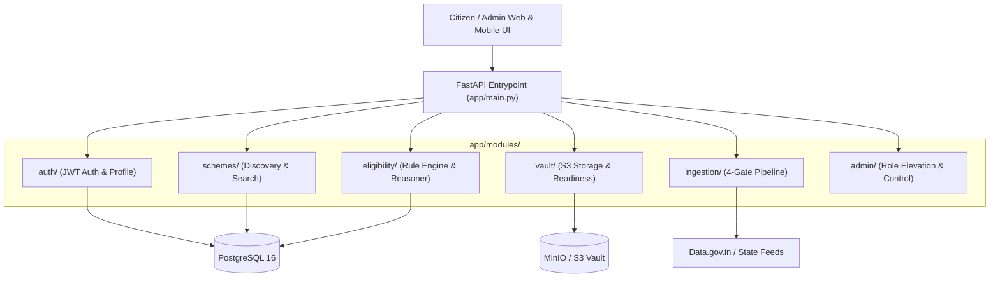

# 🏛️ Architecture Master Plan & Engineering Specification

> **System Paradigm**: Feature-Driven Modular Monolith with Integration-First Testing  
> **Target Standard**: UN GovStack / Open Welfare Engine  
> **Status**: Production-Ready (V1.5) | 100% Tests Passing

---

## 1. Core Engineering Philosophy

1. **Clarity over Cleverness**: If something breaks, find it in one self-contained feature directory—not across 15 global folders.
2. **Control over Convention**: Group code **by business capability**, never by technical layer. No top-level `controllers/`, `services/`, `models/`, or `routers/`.
3. **First-Principles over Patterns**: Ship what solves the real problem simply; avoid premature abstraction and over-engineering.
4. **Integration-First Testing**: Black-box test complete citizen journeys via realistic APIs and database state.

---

## 2. Standard 4-File Feature Pattern

Every domain feature in `app/modules/<feature>/` adheres strictly to this uniform 4-file structure:

```text
app/modules/<feature>/
├── models.py      # SQLAlchemy ORM database table definitions
├── schemas.py     # Pydantic v2 DTOs (Request / Response validation)
├── service.py     # Pure business logic, algorithms & DB queries
└── router.py      # FastAPI HTTP route handlers & dependency injection
```

---

## 3. Module Directory Breakdown

```text
app/
├── core/                  # Shared framework infrastructure
│   ├── config.py          # Environment settings (Pydantic BaseSettings)
│   ├── deps.py            # FastAPI dependency injection (get_db, get_current_user)
│   ├── exceptions.py      # Domain exception hierarchy
│   ├── error_handlers.py  # Centralized JSON error contract envelope
│   ├── pagination.py      # Generic PaginatedResponse[T] container
│   └── security.py        # Argon2id password hashing & JWT token issuing
│
├── database.py            # SQLAlchemy engine & SessionLocal factory
├── main.py                # FastAPI entrypoint, mounts feature routers
├── seeds/                 # Seed scripts (Admin creation + 4,160+ Scheme Catalog)
│
└── modules/               # Feature-Driven Domain Modules
    ├── auth/              # JWT Auth, User lifecycle, and Citizen Demographics
    ├── schemes/           # Welfare Scheme catalog, problem search, categories, CRUD
    ├── eligibility/       # Rule evaluator & plain-English explanation engine
    ├── vault/             # MinIO/S3 Document storage & Application Readiness Meter
    ├── ingestion/         # 4-Gate Gov API ingestion, RFC 7232 Caching, Diff triage
    └── admin/             # Administrative control plane & user role elevation
```

---

## 4. System Components & Data Flow



---

## 5. Core Engine Specifications

### 5.1 Scheme Discovery & Search (`/schemes`)
- **Faceted Problem Search**: Full-text searching on citizen problem statements (e.g. `?q=fertilizer`, `?q=scholarship`, `?q=pension`).
- **Category Counts**: Instant categorization across Agriculture, Healthcare, Education, Social Welfare, Housing, and MSME/Business.
- **State Filtering**: Distinguishes Central flagship schemes (`All-India`) from state-specific benefits (`Madhya Pradesh`, `Maharashtra`, `Karnataka`, `Tamil Nadu`).

### 5.2 Deterministic Rule & Reasoner Engine (`/eligibility`)
- **Evaluation Engine**: Compares citizen demographic context against rule criteria supporting `<, <=, >, >=, ==, !=, in, not_in, between, range`.
- **Explainability Model**: Categorizes evaluation into 3 clear citizen tiers:
  1. `eligible_schemes` (100% criteria met).
  2. `nearly_eligible_schemes` (50%–99% met, providing plain-English explanations of the exact unmet criteria).
  3. `ineligible_schemes` (< 50% met).

### 5.3 Citizen Document Vault & Readiness Meter (`/vault`)
- Encrypted upload of citizen identity documents to MinIO / S3 object storage.
- Issues time-limited 1-hour presigned download URLs.
- **Readiness Meter**: Compares uploaded vault documents against target scheme requirements to return percentage readiness and an actionable checklist of missing documents.

### 5.4 4-Gate Automated Government Ingestion Pipeline (`/admin/ingestion`)
- **Gate 1 (RFC 7232 Zero-Bandwidth Caching)**: Sends `If-None-Match` and `If-Modified-Since` headers to skip unchanged feeds in 0.05s.
- **Gate 2 (Raw MinIO Archival)**: Saves unedited API payloads as raw JSON audit snapshots.
- **Gate 3 (Circuit Breaker Quarantine)**: Stops ingestion if upstream API returns malformed schemas or >40% scheme dropouts.
- **Gate 4 (Semantic Hash Diffing & Triage)**: Auto-applies non-breaking updates; routes breaking criteria modifications to the admin triage queue.

---

## 6. Standard Error Contract

All endpoints guarantee predictable error responses conforming to this JSON schema:

```json
{
  "error": "ENTITY_NOT_FOUND | DUPLICATE_ENTITY | AUTHENTICATION_FAILED | PERMISSION_DENIED | VALIDATION_ERROR",
  "message": "Human-readable explanation of the failure",
  "status_code": 404
}
```

---

## 7. Upcoming Milestones

### V2.0 — Multimodal Vision LLM Fact Extraction & Citizen Verification Step
- **OCR Fact Extractor** (`app/modules/vault/ocr_service.py`): Leverages Google Gemini 1.5 Flash (free tier: 1,500 req/day) to extract demographics (`name`, `dob`, `income`, `caste`, `state`) directly from uploaded PDFs and images.
- **Citizen Confirmation Modal**: Protects citizens from OCR misread digit errors with a side-by-side editable confirmation dialog before saving to their profile.

---

## 8. 🔮 Future Roadmap: Universal Multi-Country Global Expansion

To scale this platform into a **Universal Open-Source Welfare & Public Benefit Navigator (UN / GovStack standard)** usable by any nation or municipality on Earth:

### 8.1 ISO 3166-1 Country Code & Jurisdiction Hierarchy
- Add `country_code: str` (ISO 3166-1 alpha-2 e.g. `"US"`, `"GB"`, `"CA"`, `"IN"`, `"DE"`, `"BRL"`, `"KEN"`) to `Scheme` and `Profile`.
- Add `jurisdiction_level: str` (`"federal"`, `"state_province"`, `"county"`, `"municipal"`).
- Generalize `state` $\to$ `state_province` (`"California"`, `"Ontario"`, `"Bavaria"`, `"Maharashtra"`).

### 8.2 Dynamic Multi-Currency & Locale Engine
- Add `currency: str` (ISO 4217 e.g. `"USD"`, `"GBP"`, `"EUR"`, `"INR"`, `"CAD"`).
- Format rule explanations with local currency symbols (`$`, `£`, `€`, `¥`, `₹`, `CAD`) dynamically based on scheme locale.

### 8.3 Universal Demographic Profile + Extensible Country Attributes
- Core universal fields: `country_code`, `state_province`, `postal_code`, `date_of_birth`, `gender`, `annual_income`, `household_size`, `employment_status`.
- Country-specific attributes dictionary (`country_attributes: dict[str, Any]`):
  - **USA**: `veteran_status`, `medicaid_enrolled`, `snap_eligible`, `tax_filing_status`
  - **UK**: `disability_living_allowance`, `universal_credit_claimant`
  - **Canada**: `indigenous_status`, `permanent_resident`
  - **India**: `caste_category`, `has_land`

### 8.4 Global Document Taxonomies
- Out-of-the-box readiness checklists for international jurisdictions:
  - **USA**: SSN Card, Driver's License, Form W-2 / 1040, Proof of Residency.
  - **UK**: National Insurance Number (NINO), P60 / Payslips, Council Tax Statement.
  - **Canada**: Social Insurance Number (SIN), Notice of Assessment (CRA).
  - **Global**: Passport, Birth Certificate, Bank Statement, Tax Return.
