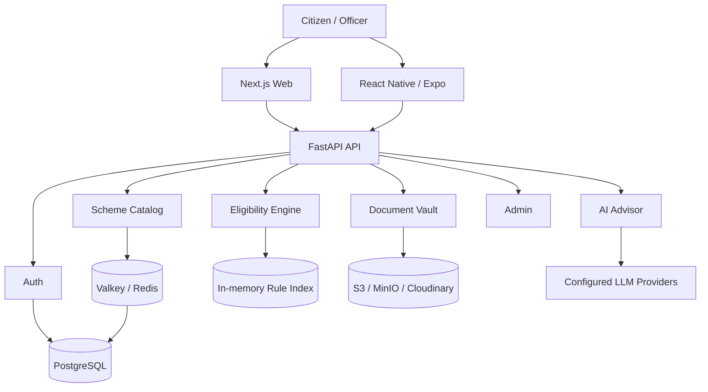

# Scheme Navigator

> A modular welfare-scheme platform for discovering government schemes, evaluating eligibility, managing supporting documents, and getting AI-assisted guidance.

[](https://www.python.org/)
[](https://fastapi.tiangolo.com/)
[](https://www.postgresql.org/)
[](https://nextjs.org/)
[](https://reactnative.dev/)
[](https://www.langchain.com/langgraph)

## Overview

Scheme Navigator is a full-stack welfare discovery and eligibility platform.

```text
Citizen profile
      |
      v
Scheme catalog ---> Eligibility engine ---> Explainable result
      |                                      |
      v                                      v
Required documents <-------------------- Application readiness
      |
      v
Document vault / OCR facts
      |
      v
AI advisor with scheme context
```

The backend is a **feature-driven modular monolith** built around FastAPI, SQLAlchemy, PostgreSQL, Valkey/Redis-compatible caching, object storage, and an AI orchestration layer. The same repository contains the Next.js web client and React Native mobile client.

## The problem

Welfare information can be hard to use because scheme details, eligibility criteria, required documents, and application guidance are distributed across different sources and often written for non-technical, program-specific workflows.

This project focuses on four engineering problems:

- **Discovery** - make a large scheme catalog searchable and browsable.
- **Eligibility** - evaluate structured rules deterministically instead of asking an LLM to make the decision.
- **Documents** - connect citizen documents and extracted facts to scheme requirements.
- **Assistance** - provide conversational guidance while keeping core business rules separate from generation.

## Features

### Deterministic eligibility engine

Scheme rules are compiled into an in-memory representation and evaluated against structured citizen facts. The API also provides an explainable result path so users can see which criteria passed or failed.

### Scheme catalog

The schemes domain manages scheme metadata such as categories, ministries, benefits, eligibility rules, and required documents. Hot catalog paths can be cached through Valkey/Redis-compatible storage.

### AI advisor

The chat domain uses LangGraph for multi-turn orchestration and can stream responses over Server-Sent Events (SSE). Provider failover can be configured so the advisor can fall back when a primary model provider is unavailable.

### Citizen document vault

The vault supports S3-compatible object storage and Cloudinary-backed storage. Documents can be processed with vision models to extract structured citizen facts while retaining document provenance.

### Administration

The admin domain provides APIs for managing schemes, benefits, eligibility rules, and required-document checklists.

## Architecture



## Repository structure

```text
scheme-backend/
├── backend/
│   ├── app/
│   │   ├── core/                 # Config, security, caching, errors, dependencies
│   │   ├── modules/
│   │   │   ├── auth/             # Authentication and citizen profiles
│   │   │   ├── schemes/          # Scheme catalog and search
│   │   │   ├── eligibility/      # Rule compilation and evaluation
│   │   │   ├── chat/             # LangGraph agent, providers, tools, SSE
│   │   │   ├── vault/            # Documents, storage, OCR-derived facts
│   │   │   └── admin/            # Administrative APIs
│   │   ├── seeds/                # Seed data and admin bootstrap
│   │   ├── database.py           # SQLAlchemy setup
│   │   └── main.py               # FastAPI entrypoint
│   ├── alembic/                  # Database migrations
│   ├── pyproject.toml            # Python dependencies and pytest config
│   └── Dockerfile
│
├── mobile/                       # React Native / Expo application
├── web/                           # Next.js application
├── scripts/                      # Development, benchmarks, E2E utilities
├── compose.yaml                  # Local PostgreSQL, MinIO, backend, web
├── Makefile                      # Common developer commands
└── README.md
```

## Tech stack

| Area | Technology |
| --- | --- |
| API | FastAPI, Uvicorn |
| Language | Python 3.13+ |
| Database | PostgreSQL 17, SQLAlchemy, Alembic |
| Cache | Valkey / Redis-compatible backend |
| Object storage | MinIO / S3, Cloudinary |
| Auth | JWT |
| AI orchestration | LangGraph, LangChain |
| LLM providers | Gemini, Groq, optional local CLI provider |
| Web | Next.js 16, TypeScript |
| Mobile | React Native, Expo 54, TypeScript |
| Testing | pytest |
| Dev tooling | uv, Docker Compose, Make |

The backend dependency configuration currently requires Python 3.13+, FastAPI 0.141+, SQLAlchemy 2.x, PostgreSQL connectivity through psycopg, Valkey support, LangGraph, Gemini/Groq integrations, and pytest. fileciteturn2file0

## Quick start

### Prerequisites

- Python 3.13+
- [uv](https://docs.astral.sh/uv/)
- Node.js 20+
- Docker and Docker Compose

### 1. Clone

```bash
git clone https://github.com/addynoven/scheme-backend.git
cd scheme-backend
```

### 2. Configure environment

```bash
cp .env.example .env
```

The example environment file defines PostgreSQL, JWT, S3/MinIO, Gemini, and Valkey settings. Fill in external credentials and replace development secrets before using a shared or production environment. fileciteturn5file0

### 3. Start development

For the repository's combined development launcher:

```bash
make dev
```

The Makefile also exposes separate commands for the backend, web app, migrations, seeding, tests, and benchmarks. fileciteturn4file0

For the Docker Compose stack:

```bash
docker compose up -d
```

Compose provisions PostgreSQL 17, MinIO, the backend, and the web app, with service health checks and startup dependencies. fileciteturn3file0

### 4. Local URLs

```text
Web app:       http://localhost:3000
API:           http://localhost:8000
Swagger docs:  http://localhost:8000/docs
MinIO API:     http://localhost:9000
MinIO Console: http://localhost:9001
```

## Common commands

```bash
# Full development stack
make dev

# Backend only
make dev-backend

# Web only
make dev-web

# Migrations
make migrate

# Seed scheme data
make seed

# Create development admin
make seed-admin

# Tests
make test

# Coverage
make test-cov

# E2E tests
make test-e2e

# Eligibility benchmark
make benchmark-multicore

# Full Docker stack
make up

# Stop Docker stack
make down
```

These commands are defined in the repository Makefile. fileciteturn4file0

## API surface

The backend is organized by business capability:

```text
/auth
/schemes
/eligibility
/chat
/vault
/admin
```

Interactive OpenAPI documentation is available at `/docs` when the API is running.

For the exact request and response contracts, treat the routers and Pydantic schemas under `backend/app/modules/` as the source of truth.

## Design decisions

### Modular monolith over microservices

The domains are related closely enough that splitting them into networked services would add operational complexity without removing the core coupling between citizen data, schemes, eligibility, documents, and chat.

The code is therefore separated by **business capability** while remaining one deployable backend.

### Deterministic rules before AI

Eligibility is fundamentally a rules evaluation problem:

```text
Structured citizen facts + scheme rules
                |
                v
      Deterministic eligibility
                |
                v
        Explainable result
                |
                v
        AI guidance / UX
```

The LLM can help users understand the result, but it does not need to become the source of truth for structured eligibility rules.

### Database as source of truth, cache as accelerator

PostgreSQL stores the durable catalog and application state. Valkey/Redis is used to reduce repeated reads on hot catalog paths; cache invalidation keeps it aligned with underlying changes.

### Graceful AI degradation

The conversational layer can use a provider cascade so temporary quota, latency, or availability problems do not have to take down the rest of the platform.

## Testing

The backend uses pytest. The default configuration excludes LLM evaluation tests that make external API calls; those tests are marked with `eval` and can be run explicitly. fileciteturn2file0

```bash
# Normal test suite
make test

# One feature
make test-feature FEAT=eligibility

# End-to-end tests
make test-e2e

# External LLM evaluation tests
cd backend
uv run pytest -m eval
```

## Security and configuration

Do not commit real secrets.

The checked-in example environment currently includes development defaults for PostgreSQL and MinIO, plus placeholders for Gemini and Valkey credentials. fileciteturn5file0

Before any public deployment, review at minimum:

- `SECRET_KEY` and JWT settings
- S3/MinIO credentials and public access configuration
- LLM and Valkey credentials
- CORS and network exposure
- document storage permissions
- logging and observability
- production database credentials and backups

## Development status

This repository contains the backend API plus its web and mobile clients. It is intended to be both a working application and an engineering project for exploring deterministic rule evaluation, document-aware workflows, caching, modular architecture, and resilient AI integration.

For production deployment, treat the repository's development defaults as examples rather than secure production configuration.

## Contributing

Keep business logic inside the relevant feature module and preserve the feature-first structure.

```bash
git checkout -b feat/my-change

# Make changes
make test
make lint

git commit -m "feat: describe the change"
```

## License

No license file is currently declared in the repository. Without an explicit license, the code should not be assumed to be available for unrestricted reuse.

## Author

Built by [addynoven](https://github.com/addynoven).

[Repository](https://github.com/addynoven/scheme-backend)
