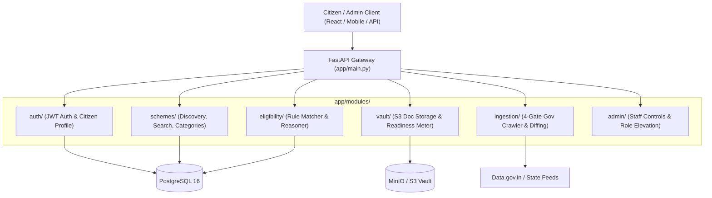

# 🏛️ Government Welfare Scheme Navigator & Eligibility API

[](https://fastapi.tiangolo.com)
[](https://www.python.org/)
[](https://www.postgresql.org/)
[](https://min.io)
[-brightgreen?style=flat&logo=pytest&logoColor=white)](https://pytest.org)

A high-performance **Feature-Driven Modular Monolith** that aggregates over **4,160+ Central and State welfare schemes**, matches citizen profiles with **deterministic rule evaluation**, generates **plain-English eligibility reasons**, and calculates **document readiness scores** backed by S3 object storage.

---

## ⚡ 60-Second Quickstart

### Option A: Complete Docker Compose Stack (Postgres + MinIO + Backend)
```bash
# 1. Start database, object storage, and backend
docker compose up -d --build

# 2. View Swagger OpenAPI Docs at:
# http://localhost:8000/docs
```

### Option B: Local Development with `uv`
```bash
# 1. Install dependencies
uv sync

# 2. Seed database (Creates admin@gov.in and auto-populates 4,160+ schemes)
make seed

# 3. Start local development server (with hot reload)
make dev

# 4. Run the full test suite (49 integration & unit tests)
make test
```

---

## 📐 Architecture & Mental Model

This repository is organized as a **Feature-Driven Modular Monolith**. Code is grouped **by business capability**, never by technical layer.



### The Standard 4-File Feature Pattern
Every domain feature in `app/modules/<feature>/` follows the exact same predictable 4-file structure:

| File | Responsibility |
| :--- | :--- |
| **`models.py`** | SQLAlchemy ORM database table definitions and relationships. |
| **`schemas.py`** | Pydantic v2 DTO models for request validation and typed API responses. |
| **`service.py`** | Pure domain business logic, computations, and database queries. |
| **`router.py`** | FastAPI endpoint handlers, status codes, and dependency injection. |

---

## 🗂️ Codebase Map

```text
scheme-backend/
├── app/
│   ├── core/                  # Shared cross-cutting concerns (config, JWT security, pagination, errors)
│   │   ├── config.py          # Pydantic BaseSettings environment variables
│   │   ├── deps.py            # FastAPI dependencies (get_db, get_current_user, get_current_admin)
│   │   ├── exceptions.py      # Standard domain exceptions (SchemeNotFoundError, etc.)
│   │   ├── error_handlers.py  # Centralized JSON error contract envelope
│   │   ├── pagination.py      # Generic PaginatedResponse[T] container
│   │   └── security.py        # Argon2id password hashing & JWT token issuing
│   │
│   ├── database.py            # SQLAlchemy engine & SessionLocal factory
│   ├── main.py                # FastAPI entrypoint, mounts feature routers
│   ├── seeds/                 # DB seeders (4,160 National/State schemes + Admin user)
│   │
│   └── modules/               # Feature-Driven Domain Modules
│       ├── admin/             # Administrative control plane & user role elevation
│       ├── auth/              # Registration, Login, Token Refresh, and Citizen Demographics
│       ├── eligibility/       # Fast binary matcher & plain-English eligibility explanation engine
│       ├── ingestion/         # RFC 7232 Caching, MinIO Raw Archival, Circuit Breaker, Diff Triage
│       ├── schemes/           # Welfare Scheme search, problem tagging, categories, and CRUD
│       └── vault/             # Citizen document upload, presigned URLs, application readiness
│
├── tests/
│   ├── integration/           # Black-box API tests across all features (42 tests)
│   └── unit/                  # Rule engine edge cases & boundary tests (7 tests)
│
├── api.http                   # Ready-to-use VS Code / IntelliJ HTTP request playground
├── Makefile                   # 1-command developer shortcuts (make dev, make test, make seed)
└── .env.example               # Environment variables template
```

---

## 🧩 Core Product Engines

### 1. Scheme Discovery Engine (`/schemes`)
- **Faceted Search**: Full-text and keyword search by problem statement (e.g. `?q=fertilizer`, `?q=pension`, `?q=scholarship`).
- **Categorization**: Instant filtering across Agriculture, Healthcare, Education, Social Welfare, Housing, and Business/MSME.
- **State Filtering**: Distinguishes Central flagship schemes (`All-India`) from state-specific schemes (`Madhya Pradesh`, `Maharashtra`, `Karnataka`, `Tamil Nadu`).

### 2. Explainable Eligibility Reasoner (`/eligibility`)
- Evaluates citizen demographic context (`age`, `gender`, `state`, `annual_income`, `occupation`, `caste_category`, `has_land`, `is_differently_abled`).
- Supports comparison operators: `<`, `<=`, `>`, `>=`, `==`, `!=`, `in`, `not_in`, `between`, `range` (`18-60`).
- **Human-Friendly Explanations**: Rather than returning a blank `true/false`, the engine provides plain-English verdicts:
  - **`eligible_schemes`** (100% criteria passed).
  - **`nearly_eligible_schemes`** (50%–99% matched, listing the exact unmet criteria e.g. *"Your annual income (₹3,00,000) exceeds the maximum limit of ₹2,50,000"*).
  - **`ineligible_schemes`** (<50% matched).

### 3. Citizen Document Vault & Readiness Meter (`/vault`)
- Encrypted upload of citizen credentials (Aadhaar, PAN Card, Bank Passbooks, Land Records) to MinIO/S3 object storage.
- Issues time-limited presigned download URLs.
- **Readiness Meter**: Evaluates uploaded documents against a target scheme's required documents list and returns an actionable checklist (e.g. `2/3 mandatory documents ready (67%)`, identifying missing items).

### 4. 4-Gate Automated Government Ingestion Pipeline (`/admin/ingestion`)
- **Gate 1 (RFC 7232 Zero-Bandwidth Caching)**: Sends `If-None-Match` and `If-Modified-Since` headers to skip unchanged feeds in 0.05s.
- **Gate 2 (Raw MinIO Archival)**: Stores untouched payloads as unedited audit trails.
- **Gate 3 (Circuit Breaker Quarantine)**: Halts ingestion if an upstream API returns malformed structures or >40% missing schemes.
- **Gate 4 (Semantic Hash Diffing & Triage)**: Automatically updates unchanged or non-breaking metadata; routes breaking changes (e.g. income limit changes) to the admin review queue.

---

## 🛠️ Developer Command Reference (`Makefile`)

| Command | Description |
| :--- | :--- |
| **`make dev`** | Starts FastAPI server at `http://localhost:8000` with hot-reload. |
| **`make test`** | Runs all 49 integration and unit tests via `pytest`. |
| **`make test-cov`** | Runs tests and prints code coverage report. |
| **`make seed`** | Seeds default Admin (`admin@gov.in`) and 4,160+ welfare schemes. |
| **`make db-up`** | Starts local PostgreSQL 16 and MinIO background containers. |
| **`make db-down`** | Stops Docker background containers. |
| **`make lint`** | Runs Ruff linting and formatting across all files. |

---

## 🧪 Testing & Verification

The test suite emphasizes **black-box integration testing** of complete citizen workflows:

```bash
uv run pytest -v
```

### Verified Scenarios in Test Suite:
1. **Persona 1 (Farmer Ramesh)**: Madhya Pradesh farmer receives PM-Kisan (₹6,000) + MP CM Kisan Kalyan (₹4,000) + PM Fasal Bima.
2. **Persona 2 (Girl Child Priya)**: 14yo student matches Beti Bachao Beti Padhao + Post-Matric Scholarship.
3. **Persona 3 (Senior Citizen Murugan)**: 65yo Tamil Nadu resident qualifies for National Social Assistance Old Age Pension.
4. **Persona 4 (Rural Artisan Sunita)**: Female weaver qualifies for PM Vishwakarma + Mahila Samman Savings.
5. **Persona 5 (High-Income Vikram)**: IT professional (₹24L income) correctly filtered out of BPL welfare schemes.
6. **Application Readiness Meter**: Uploading a PAN Card updates application readiness score from `0%` to `50%`.
7. **Ingestion 4-Gates**: HTTP 304 skipping, circuit breaker quarantine, and admin triage approval.

---

## 🚀 How to Add a New Feature in 4 Steps

Adding a feature to this modular monolith is predictable:

1. **Create Feature Folder**: `app/modules/<feature_name>/`
2. **Define Data Model**: Create `models.py` with SQLAlchemy ORM tables.
3. **Define Pydantic DTOs**: Create `schemas.py` with request/response schemas (`from_attributes=True`).
4. **Write Business Logic**: Create `service.py` with pure domain operations.
5. **Expose Routes**: Create `router.py` with FastAPI endpoints and mount in `app/main.py` using `app.include_router(...)`.

## 🔮 Future Roadmap: Universal Multi-Country Expansion

Planned evolution to support any nation or municipality (UN / GovStack standard):

- **ISO 3166-1 Country Code & Jurisdiction**: Add `country_code` (`"US"`, `"GB"`, `"CA"`, `"IN"`, `"DE"`) and `jurisdiction_level` (`"federal"`, `"state"`, `"municipal"`).
- **Dynamic Multi-Currency**: Locale-aware formatting for `$`, `£`, `€`, `¥`, `₹`, `CAD`.
- **Extensible Country Demographics**: Universal core fields (`income`, `age`, `household_size`) paired with flexible country-specific attributes (e.g. US: `veteran_status`, `medicaid_enrolled`; UK: `universal_credit_claimant`).
- **Global Document Taxonomies**: Out-of-the-box readiness checklists for US (SSN, W-2, 1040), UK (NINO, P60), and Canada (SIN, CRA Notice of Assessment).

---

## 📄 License
This project is licensed under the MIT License.
