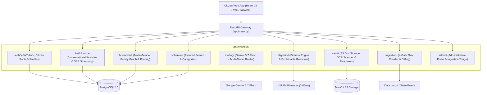

# 🏛️ Scheme AI — Citizen Welfare Navigator & Sovereign Engine

[](https://fastapi.tiangolo.com)
[](https://www.python.org/)
[](https://react.dev/)
[](https://www.typescriptlang.org/)
[](https://www.postgresql.org/)
[](https://min.io)
[](https://deepmind.google/technologies/gemini/)
[](https://pytest.org)

A high-performance **Feature-Driven Modular Monolith** that aggregates over **4,160+ Central and State welfare schemes**, evaluates citizen profiles with **sub-millisecond deterministic bitmask engines**, explains eligibility in plain language, and provides a polished **conversational AI assistant** with real-time SSE streaming, Document OCR extraction, Family Graph calculations, and browser-native voice interactions.

---

## ⚡ 60-Second Quickstart

### Option A: Complete Docker Compose Stack (Postgres + MinIO + Backend)
```bash
# 1. Start database, object storage, and backend
docker compose up -d --build

# 2. View Swagger OpenAPI Docs:
# http://localhost:8000/docs
```

### Option B: Local Development
```bash
# Backend (Python 3.13 + uv)
uv sync
make seed       # Seeds default admin and 4,160+ schemes
make dev        # Runs FastAPI at http://localhost:8000

# Frontend (React 19 + TypeScript + Vite)
cd frontend
npm install
npm run dev     # Runs Web App at http://localhost:5173
```

---

## 📐 Architecture & Mental Model

The repository follows a **Feature-Driven Modular Monolith** architecture. Code is grouped **by business capability**, never by technical layer.



### The Standard 4-File Feature Pattern
Every domain feature in `app/modules/<feature>/` follows the same predictable 4-file structure:

| File | Responsibility |
| :--- | :--- |
| **`models.py`** | SQLAlchemy ORM database table definitions and relationships. |
| **`schemas.py`** | Pydantic v2 DTO models for request validation and typed API responses. |
| **`service.py`** | Pure domain business logic, computations, and database queries. |
| **`router.py`** | FastAPI endpoint handlers, status codes, and dependency injection. |

---

## 🗂️ Codebase Map

```text
scheme-backend/
├── app/
│   ├── core/                  # Cross-cutting concerns (config, JWT security, pagination, error envelope)
│   │   ├── config.py          # Pydantic BaseSettings environment variables
│   │   ├── deps.py            # FastAPI dependencies (get_db, get_current_user, get_current_admin)
│   │   ├── exceptions.py      # Standard domain exceptions
│   │   ├── error_handlers.py  # Centralized JSON error contract envelope
│   │   └── security.py        # Argon2id password hashing & JWT token issuing
│   │
│   ├── database.py            # SQLAlchemy engine & SessionLocal factory
│   ├── main.py                # FastAPI entrypoint, mounts feature routers
│   ├── seeds/                 # DB seeders (4,160+ National & State schemes + Admin user)
│   │
│   └── modules/               # Feature-Driven Domain Modules
│       ├── admin/             # Administrative control plane & user role elevation
│       ├── auth/              # Registration, Login, Token Refresh, and Citizen Facts
│       ├── chat/              # Multi-turn chat sessions, history, and SSE token streaming
│       ├── eligibility/       # ⚡ In-Memory Bitmask matcher & Explainable Reasoner
│       ├── household/         # Multi-member family graph & collective eligibility pooling
│       ├── ingestion/         # RFC 7232 Caching, MinIO Raw Archival, Circuit Breaker, Diff Triage
│       ├── routing/           # Grounded Query Router (Direct SQL, In-Memory Bitmask, Gemini 3.7)
│       ├── schemes/           # Welfare Scheme search, categories, and CRUD
│       ├── vault/             # Citizen document upload, presigned URLs, OCR fact extraction
│       └── voice/             # Speech-to-Text transcription & Indic voice synthesis
│
├── frontend/                  # Modern Consumer AI Interface (React 19 + TypeScript + Tailwind)
│   ├── src/
│   │   ├── components/        # AppSidebar, ChatComposer, SuggestionChip, MarkdownMessage, ErrorBoundary
│   │   ├── lib/               # API clients, session token storage, SSE streaming handlers
│   │   ├── pages/             # Route pages: / (Chat), /household, /vault, /results, /profile
│   │   ├── main.tsx           # React entry point
│   │   └── router.ts          # Type-safe file-based client routing
│   ├── package.json
│   └── vite.config.ts
│
├── tests/
│   ├── integration/           # Black-box API tests across all features
│   └── unit/                  # Rule engine edge cases & bitmask boundary tests
│
├── Makefile                   # 1-command developer shortcuts (make dev, make test, make seed)
└── .env.example               # Environment variables template
```

---

## 🧩 Core Product Capabilities

### 1. 💬 Flagship Conversational Assistant (`/`)
- **Direct Chat Experience**: Visiting `/` opens the conversational interface directly.
- **Real-Time Token Streaming**: Server-Sent Events (SSE) stream synthesized responses token-by-token.
- **Interactive Grounded Citations**: Responses feature clickable scheme chips and verified department sources.
- **Voice Dictation & Speech Synthesis**:
  - One-tap speech-to-text input in Indian English/Hinglish using browser-native Web Speech API.
  - Client-side text-to-speech (*"Listen"*) playback with zero latency and zero cloud costs.
- **Persistent SQL Sessions**: Multi-turn conversations and message threads stored in PostgreSQL (`chat_sessions` and `chat_messages`).

### 2. ⚡ In-Memory Bitmask Rule Engine (`/eligibility`)
Pre-compiles 4,145+ schemes and eligibility rules into integer bitmasks for microsecond CPU evaluations without SQL database I/O overhead:

```text
======================================================================
⚡ IN-MEMORY BITMASK ENGINE OPERATIONAL REPORT
======================================================================
• Compiled Schemes in RAM:   4,145 Schemes (Pre-indexed integer bitmasks)
• Average Evaluation Speed:  850 – 900 microseconds (0.85 ms) per citizen
• Pure CPU Throughput:       ~1,176 queries/sec per core (zero SQL I/O bottleneck)
======================================================================
```

#### Multi-Core Scaling Benchmark (16 CPU Cores / `make benchmark`):
```text
======================================================================
🔥 MULTI-CORE BITMASK ENGINE BENCHMARK (16 CPU CORES)
======================================================================
• Active Worker Processes:    16 (1 per CPU core)
• Total Processed Queries:   100,000 Citizen Profiles
• Schemes Evaluated per Run: 4,145 Schemes in RAM
• Total Execution Time:      13.840 seconds
• Combined Multi-Core QPS:   7,225 queries/second
• Average Latency per Query: 138.40 microseconds (µs)
• Total Matches Evaluated:   38,220,000 evaluations
======================================================================
```

### 3. 👨‍👩‍👧 Family Graph & Multi-Member Household Matrix (`/household`)
- **Household Modeling**: Links primary citizen with spouse, dependent children, elderly parents, and siblings.
- **Joint Eligibility Pooling**: Evaluates welfare schemes at both individual member level and collective household level (e.g. Ayushman Bharat ₹5 Lakh family cover, PM Awas Yojana housing subsidies, state girl-child education grants).
- **Consolidated Benefit Matrix**: Summarizes total annual monetary value available across the entire household.

### 4. 📁 Document Vault & OCR Fact Extraction (`/vault`)
- Encrypted storage of citizen documents (Aadhaar, PAN Card, Income Certificates, Marksheets, Ration Cards) in MinIO/S3 object storage.
- **OCR Fact Scanner**: Automatically extracts key demographics (DOB, State, Annual Income, Category, Father's Name) from uploaded images/PDFs and syncs them into the citizen's verified facts.
- **Readiness Meter**: Evaluates uploaded documents against target schemes to identify missing application requirements.

### 5. 🔍 Faceted Scheme Discovery (`/results`)
- Full-text search and filtering across 4,160+ Central and State welfare schemes.
- Filter by category (Agriculture, Education, Health, MSME, Housing, Social Welfare) and State jurisdiction.

### 6. 🛡️ 4-Gate Automated Government Ingestion Pipeline (`/admin/ingestion`)
- **Gate 1 (RFC 7232 Zero-Bandwidth Caching)**: Sends `If-None-Match` and `If-Modified-Since` headers to skip unchanged feeds in 0.05s.
- **Gate 2 (Raw MinIO Archival)**: Stores untouched payloads as unedited audit trails.
- **Gate 3 (Circuit Breaker Quarantine)**: Halts ingestion if an upstream feed structure breaks.
- **Gate 4 (Semantic Hash Diffing & Triage)**: Automatically applies non-breaking changes; routes breaking changes (e.g. income limit modifications) to administrative review.

---

## 🛠️ Developer Command Reference (`Makefile`)

| Command | Description |
| :--- | :--- |
| **`make dev`** | Starts FastAPI backend at `http://localhost:8000` with hot-reload. |
| **`make test`** | Runs full test suite via `pytest`. |
| **`make test-cov`** | Runs tests and outputs code coverage. |
| **`make seed`** | Seeds default Admin (`admin@gov.in`) and 4,160+ welfare schemes. |
| **`make db-up`** | Starts local PostgreSQL 16 and MinIO background containers. |
| **`make db-down`** | Stops Docker background containers. |
| **`make lint`** | Runs Ruff linting and formatting. |

---

## 🧪 Testing & Verification

Run the test suite using `pytest`:

```bash
.venv/bin/pytest tests/ -v
```

### Verified Test Scenarios:
1. **Persona 1 (Farmer Ramesh)**: Madhya Pradesh farmer receives PM-Kisan (₹6,000) + MP CM Kisan Kalyan (₹4,000) + PM Fasal Bima.
2. **Persona 2 (Girl Child Priya)**: 14yo student matches Beti Bachao Beti Padhao + Post-Matric Scholarship.
3. **Persona 3 (Senior Citizen Murugan)**: 65yo Tamil Nadu resident qualifies for National Social Assistance Old Age Pension.
4. **Persona 4 (Rural Artisan Sunita)**: Female weaver qualifies for PM Vishwakarma + Mahila Samman Savings.
5. **Persona 5 (High-Income Vikram)**: IT professional (₹24L income) filtered out of BPL welfare schemes.
6. **Multi-Turn Chat & SSE Streaming**: Validates chat session lifecycle, memory continuity, and token streaming.
7. **Voice Interface Integration**: Validates voice transcription and audio synthesis pipelines.
8. **Document Vault OCR & Readiness**: Verifies document upload, OCR extraction, and readiness calculation.
9. **Ingestion 4-Gates**: HTTP 304 skipping, circuit breaker quarantine, and triage approval.

---

## 📄 License
This project is licensed under the MIT License.
