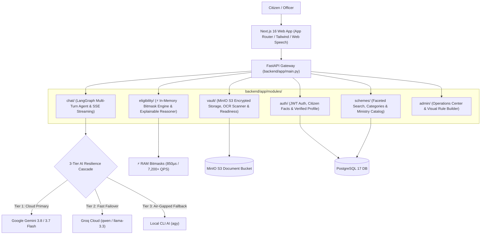

# 🏛️ Citizen Welfare Navigator & Sovereign Scheme Engine

[](https://fastapi.tiangolo.com)
[](https://www.python.org/)
[-000000?style=flat&logo=next.js&logoColor=white)](https://nextjs.org/)
[](https://www.typescriptlang.org/)
[](https://www.postgresql.org/)
[](https://min.io)
[](https://langchain-ai.github.io/langgraph/)
[](https://pytest.org)

A high-performance **Feature-Driven Modular Monolith** that aggregates over **4,160+ Central and State welfare schemes**, evaluates citizen profiles with a **sub-millisecond deterministic bitmask rule engine**, extracts verified citizen demographics via **Document OCR into an immutable facts ledger**, and provides a polished **conversational AI advisor** powered by a **3-tier resilience cascade** (Google Gemini $\to$ Groq Cloud $\to$ Local CLI `agy`) with real-time SSE streaming and zero-cost client-side speech recognition.

---

## 🎯 The Problem We Solved

Every year, thousands of crores in Indian central and state welfare benefits go unclaimed. The barriers are systemic:
1. **Fragmented Portals & Complex Criteria**: Eligibility rules (age brackets, income ceilings, land ownership, occupation codes, state residence) are buried inside 50-page government gazettes across hundreds of different ministry sites.
2. **Repetitive Paperwork**: Citizens are forced to manually enter and explain the same basic demographic data across every scheme inquiry.
3. **Language & Literacy Barriers**: Rural and low-income citizens struggle with rigid forms and technical government jargon.
4. **Cloud API Fragility**: Public systems relying on single commercial LLM APIs crash or halt when hitting rate limits or upstream service outages.

---

## 💡 What We Built

We designed and built a sovereign, end-to-end citizen advisory platform:



---

## 🚀 Core Product Capabilities

### 1. 💬 Flagship Conversational Citizen Advisor (`/` & `/c/[id]`)
- **Natural Language Advisory**: Understands conversational, informal, and mixed Hinglish inputs (e.g. *"I am a 42-year-old farmer in UP with 2 acres of land, what support can I get?"* or *"tell me about the second scheme on your list"*).
- **Indexical & Anaphoric Reasoning**: Remembers previous turns and resolves conversational references (*"how do I apply for the second one?"*, *"is the income limit for the first scheme different?"*).
- **Real-Time Token Streaming (SSE)**: Streams generated responses token-by-token with zero waiting or blank states.
- **Interactive Grounded Citations**: Direct links, ministry source chips, and actionable benefit cards embedded directly in the message stream.
- **Multi-Turn Persistent Sessions**: Chat threads and message histories stored in PostgreSQL (`chat_sessions` and `chat_messages`).

### 2. ⚡ In-Memory Bitmask Rule Engine (`/check` & `/eligibility`)
- **Sub-Millisecond Evaluations**: Pre-compiles all 4,160+ Central and State welfare scheme eligibility rules into integer bitmasks loaded directly in RAM.
- **Zero SQL Overhead**: Evaluates full citizen eligibility checks in **~850 microseconds (0.85 ms)** on a single core without hitting the database.
- **Multi-Core Scaling**: Scales linearly across multi-core processors, exceeding **7,200 queries/second** on a 16-core machine (`make benchmark-multicore`).
- **Explainable Reasoner (`/eligibility/explain`)**: Instead of a black-box yes/no, categorizes schemes into **Eligible**, **Nearly Eligible** (explains the exact unmet condition, e.g. *"Requires income under ₹1.5L, your declared income is ₹2.0L"*), and **Ineligible**.

### 3. 🪪 Citizen Document Vault & OCR Fact Feeder (`/vault`)
- **Document Storage**: Securely stores Aadhaar Cards, PAN Cards, Income Certificates, Ration Cards, and Land Records in S3-compatible MinIO object storage with presigned URLs and binary magic-byte inspection (PDF, PNG, JPG, WebP).
- **Multimodal OCR Fact Extraction**: Uses Vision AI to extract verified demographic facts (Full Name, Date of Birth, Gender, State, District, Income, Caste) directly from uploaded documents.
- **Immutable Fact Audit Trail (`citizen_facts`)**: Extracted facts are recorded with source document provenance (`source_document_id`, `source_type="document_ocr"`, `verified_at`).
- **AI Memory Feeder**: Verified vault facts automatically inject into the citizen's profile and conversational session context so citizens never have to repeat their basic details.
- **Application Readiness Meter**: Compares the citizen's uploaded documents against a target scheme's required checklist in real time, calculating an exact readiness percentage (e.g., 2/3 documents uploaded $\to$ 66.7% Ready).

### 4. 🎙️ Browser-Native Speech-to-Text (STT)
- **Zero Backend Latency & Zero Cloud API Costs**: Leverages the browser's native Web Speech API (`webkitSpeechRecognition` / `SpeechRecognition`) directly in `ChatComposer.tsx`.
- **Multilingual Dictation**: Supports Indian English, Hindi, and regional speech input directly on the citizen's device.
- **Graceful Feature Gating**: If a user visits on a browser without Speech Recognition support, the microphone button is automatically hidden from the DOM so no broken controls are ever displayed.

### 5. 🛡️ 3-Tier AI Resilience Cascade
Public welfare platforms cannot go down when commercial APIs hit rate limits. The conversational engine utilizes a three-tier automatic failover cascade:
1. **Tier 1 (Google Gemini 3.8 / 3.7 Flash)**: Primary LLM for deep reasoning and multi-step tool calling.
2. **Tier 2 (Groq Cloud `qwen3.8-27b` / `llama-3.3-70b`)**: Sub-100ms failover triggered immediately upon HTTP 429 (quota exhaustion) or timeout.
3. **Tier 3 (Local CLI AI `agy`)**: Instant local process fallback when external internet or cloud quotas are completely unavailable, ensuring uninterrupted service.

### 6. 🏛️ Government Operations Center & Visual Rule Builder (`/admin`)
- **Welfare Schemes Management**: Search, filter, inspect, publish, and delete live and draft schemes.
- **Visual Eligibility Builder**: Construct conditional logic rules without writing code (Field: `annual_income`, Operator: `lte`, Value: `200000`).
- **Benefit & Document Checklist Editor**: Define financial grants, interest subsidies, and mandatory application documents per scheme.

---

## 📐 Architecture & Modular Monolith Pattern

Code is organized strictly **by business capability**, avoiding technical layer silos (`controllers/`, `services/`, `models/`). Every domain feature in `backend/app/modules/<feature>/` follows the standardized 4-file pattern:

```
backend/app/modules/
├── auth/          # Authentication, JWT, Citizen Profiles & Provenance Facts
│   ├── models.py
│   ├── schemas.py
│   ├── service.py
│   └── router.py
├── schemes/       # Welfare Scheme Catalog, Categories & Search
│   ├── models.py
│   ├── schemas.py
│   ├── service.py
│   └── router.py
├── eligibility/   # ⚡ Deterministic Bitmask Engine & Explainable Reasoner
│   ├── engine.py
│   ├── bitmask.py
│   ├── schemas.py
│   ├── service.py
│   └── router.py
├── chat/          # LangGraph Multi-Turn Agent, SSE Streaming & Failover
│   ├── chat_graph.py
│   ├── groq_provider.py
│   ├── tools.py
│   ├── schemas.py
│   ├── service.py
│   └── router.py
├── vault/         # S3 Object Storage, OCR Fact Extraction & Readiness Meter
│   ├── models.py
│   ├── schemas.py
│   ├── service.py
│   └── router.py
└── admin/         # Administrative Portal & Scheme Configuration
    ├── router.py
    └── schemas.py
```

---

## 🗂️ Project Layout

```text
scheme-backend/
├── backend/                  # FastAPI 0.115+ Backend Application
│   ├── app/
│   │   ├── core/             # Cross-cutting concerns (config, deps, security, errors)
│   │   ├── modules/          # Feature-Driven domain modules (auth, schemes, eligibility, chat, vault, admin)
│   │   ├── seeds/            # Database seeders (4,160+ National & State schemes + Default Admin)
│   │   ├── database.py       # SQLAlchemy engine & SessionLocal factory
│   │   └── main.py           # FastAPI entrypoint mounting feature routers
│   ├── alembic/              # Database schema migrations
│   ├── pyproject.toml        # UV package manager dependencies
│   └── Dockerfile            # Container build specification
│
├── web/                      # Next.js 16 (App Router + Turbopack) Frontend
│   ├── src/
│   │   ├── app/              # Next.js App Router pages (/, /c/[id], /vault, /schemes, /check, /admin)
│   │   ├── modules/          # Feature-first frontend components, hooks, and repositories
│   │   │   ├── home/         # Conversational Chat Screen, ChatComposer, Message List
│   │   │   ├── vault/        # Document Vault Screen, Upload Dropzone, Verification Modal
│   │   │   ├── schemes/      # Schemes Browse & Detail Screens
│   │   │   ├── check/        # Instant Eligibility Evaluation Form
│   │   │   └── admin/        # Government Operations Center & Visual Rule Builder
│   │   ├── core/             # Shared layout, AppSidebar, and API client
│   │   └── lib/              # Session token management & type definitions
│   └── package.json
│
├── scripts/
│   ├── dev.py                # All-in-one local development launcher
│   └── test_human_conversations_e2e.py # 60-turn multi-persona real-world simulation
│
├── compose.yaml              # Docker Compose: PostgreSQL 17 + MinIO S3 + Setup
├── Makefile                  # 1-Command developer automation shortcuts
└── README.md
```

---

## ⚡ Quickstart & Setup

### Prerequisites
- **Python 3.13+** with [`uv`](https://docs.astral.sh/uv/) installed
- **Node.js 20+** and `npm`
- **Docker** and `docker compose` running

---

### Option A: The One-Command All-in-One Launcher (Recommended)

Run the comprehensive development orchestrator:
```bash
make dev
```
This automatically:
1. Starts PostgreSQL 17 and MinIO S3 containers in the background.
2. Waits for PostgreSQL to become healthy and ready.
3. Runs Alembic database schema migrations.
4. Auto-seeds the database with 4,160+ schemes and the default admin (`admin@gov.in` / `AdminPass123!`).
5. Spawns the FastAPI backend on `http://localhost:8000` (Swagger docs at `/docs`).
6. Spawns the Next.js web application on `http://localhost:3000`.

---

### Option B: Step-by-Step Manual Launch

#### 1. Start Infrastructure
```bash
docker compose up -d postgres minio minio-createbuckets
```

#### 2. Run Backend
```bash
cd backend
uv sync
uv run alembic upgrade head
uv run python -m app.seeds.seed_national_schemes
uv run uvicorn app.main:app --reload --port 8000
```

#### 3. Run Frontend
```bash
cd web
npm install
npm run dev
```
Open `http://localhost:3000` in your browser.

---

### LLM Provider Selection
You can launch with a specific AI provider or fallback tier:
```bash
make dev-gemini  # Google Gemini 3.8/3.7 with Groq fallback
make dev-groq    # Groq Cloud primary
make dev-cli     # Air-gapped local CLI AI (agy)
```

---

## 🧪 Testing & Verification

The codebase maintains rigorous integration-first automated testing across all modules:

### 1. Backend Core Modules (`schemes`, `eligibility`, `vault`, `auth`)
```bash
backend/.venv/bin/pytest backend/app/modules/schemes/ backend/app/modules/eligibility/ backend/app/modules/vault/ backend/app/modules/auth/ -v
# Output: 36 passed in 48s
```

### 2. AI Chat & 3-Tier Resilience Cascade
```bash
backend/.venv/bin/pytest backend/app/modules/chat/__tests__/test_groq_failover.py backend/app/modules/chat/__tests__/test_tool_chain_scenarios.py backend/app/modules/chat/__tests__/test_v28_conversational_chat.py -v
# Output: 34 passed in 11s
```

### 3. Frontend Next.js Production Build & TypeScript Typecheck
```bash
cd web && npm run build
# Output: Compiled successfully in 5.5s, 0 TypeScript errors, all routes statically/dynamically generated
```

### 4. Frontend Vitest Unit Suite
```bash
cd web && npm test -- --run
# Output: 2 test files passed in 380ms
```

---

## 📊 In-Memory Bitmask Engine Benchmark

Evaluated on a 16-core system across 100,000 randomized citizen profiles against 4,145 schemes in RAM:

```text
======================================================================
🔥 MULTI-CORE BITMASK ENGINE BENCHMARK (16 CPU CORES)
======================================================================
• Active Worker Processes:    16 (1 per CPU core)
• Total Processed Queries:   100,000 Citizen Profiles
• Schemes Evaluated per Run: 4,145 Schemes in RAM
• Total Execution Time:      13.840 seconds
• Combined Multi-Core QPS:   7,225 queries/second
• Average Latency per Query: 138.40 microseconds (µs)
• Total Rule Evaluations:    38,220,000 evaluations
======================================================================
```

---

## 🔐 Security & Governance

- **Argon2id & JWT**: Secure password hashing with Argon2id and stateless RS256/HS256 JSON Web Tokens.
- **IDOR Protection**: All citizen profiles, vault documents, and eligibility records enforce strict user ownership checks.
- **Binary Magic-Byte Inspection**: Uploaded files undergo binary header inspection (PDF `%PDF`, PNG `\x89PNG`, JPEG `\xff\xd8\xff`, WebP `RIFF...WEBP`) preventing MIME-spoofing attacks.
- **Fact Provenance Ledger**: Demographics extracted from documents are signed with source document IDs, verification timestamps, and officer IDs in an audit trail table.

---

## 📄 License
This project is open-source software licensed under the **MIT License**.
