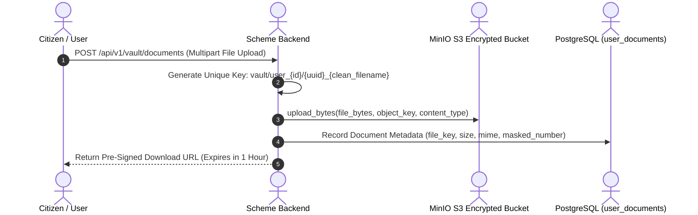

# Document Vault & Scheme Readiness Meter

A secure cloud storage and document classification engine that tracks citizen welfare certificates and computes an algorithmic **Scheme Application Readiness Score ($0\text{--}100\%$)** based on mandatory document fulfillment.

---

## 1. Document Ingestion & MinIO Storage Pipeline



---

## 2. Indian Welfare Document Synonym Clustering

To bridge terminology discrepancies across ministries (e.g. one department requests "Khasra", another requests "Land Possession Certificate"), the engine groups aliases into canonical equivalence clusters:

```python
DOCUMENT_SYNONYM_CLUSTERS = [
    {"aadhaar", "aadhaar card", "uidai", "parent aadhaar card"},
    {"pan", "pan card", "permanent account number", "pan proof"},
    {"bank passbook", "bank account", "bank statement", "passbook"},
    {"income certificate", "bpl certificate", "bpl card", "income proof"},
    {"ration card", "family ration card", "bpl card"},
    {"land records", "land possession certificate", "khasra", "khatauni"},
    {"birth certificate", "age proof", "age proof certificate"},
    {"caste certificate", "community certificate"},
    {"marksheet", "academic marksheet", "10th marksheet", "qualification certificate"},
    {"business address proof", "udyam registration", "business proof", "msme registration"},
]
```

---

## 3. The Scheme Readiness Algorithm

The readiness meter calculates whether a citizen holds the mandatory paperwork required to submit an application:

```python
def calculate_scheme_document_readiness(
    db: Session, user_id: int, scheme_slug: str
) -> SchemeDocumentReadinessResponse:
    scheme = get_scheme_by_slug(db, scheme_slug)
    user_docs = get_user_documents(db, user_id)

    total_mandatory = sum(1 for d in scheme.required_documents if d.is_mandatory)
    mandatory_present = 0
    document_items = []

    for req_doc in scheme.required_documents:
        # Match against uploaded documents using synonym clusters
        matched_doc = next(
            (u for u in user_docs if _is_doc_match(req_doc.document_name, u.document_type)),
            None
        )
        is_available = matched_doc is not None
        if req_doc.is_mandatory and is_available:
            mandatory_present += 1

        document_items.append({
            "document_name": req_doc.document_name,
            "is_mandatory": req_doc.is_mandatory,
            "is_available": is_available,
            "user_document_id": matched_doc.id if matched_doc else None,
        })

    readiness_percentage = (
        round((mandatory_present / total_mandatory) * 100, 1) if total_mandatory > 0 else 100.0
    )

    if readiness_percentage == 100.0:
        badge = "READY"
    elif readiness_percentage > 0.0:
        badge = "PARTIAL"
    else:
        badge = "BLOCKED"

    return SchemeDocumentReadinessResponse(
        scheme_name=scheme.name,
        readiness_percentage=readiness_percentage,
        readiness_badge=badge,
        documents=document_items,
    )
```

---

## 4. Readiness State Machine

```
┌────────────────────────────────────────────────────────────────────────┐
│                        READINESS STATUS TIERS                          │
├─────────────────┬──────────────┬───────────────────────────────────────┤
│ Tier            │ Range        │ User Action Enabled                   │
├─────────────────┼──────────────┼───────────────────────────────────────┤
│ **READY**       │ 100%         │ 1-Click Scheme Application Kit (PDF)  │
│ **PARTIAL**     │ 1% - 99%     │ Highlight Missing Document Upload CTA │
│ **BLOCKED**     │ 0%           │ Step-by-Step Guidance to Apply for Doc│
└─────────────────┴──────────────┴───────────────────────────────────────┘
```

---

## 5. Related Graph Connections

- **[[Multimodal Vision OCR and Citizen Fact Provenance|Pipeline: Vision OCR & Fact Provenance]]**: Automatic document classification and fact extraction on upload.
- **[[Govt Scheme Navigator System Architecture|System: Govt Scheme Navigator]]**: Platform architecture overview.
- **[[Household Welfare Graph and Family Eligibility Engine|Engine: Household Welfare Graph]]**: Document vault sharing across family members.
- **[[README|Master Map of Content (MOC)]]**: Root directory.
