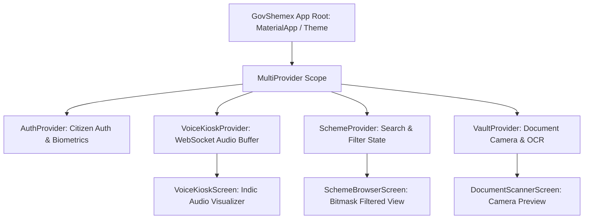

# GovShemex Flutter Client State Architecture & Kiosk Ergonomics

A mobile and hardware kiosk systems architecture blueprint derived from **GovShemex (`govshemex/lib/`)**, analyzing Provider state separation, WebSocket audio buffering, hardware camera scanning, and offline-first eligibility caches.

---

## 1. Flutter Provider State Architecture Layout



```
┌──────────────────────────────┬──────────────────────────────┬────────────────────────────────────────┐
│ State Provider               │ State Boundary & Storage     │ Lifecycle & UI Invariant               │
├──────────────────────────────┼──────────────────────────────┼────────────────────────────────────────┤
│ **1. `VoiceKioskProvider`**  │ In-Memory PCM Ring Buffer    │ Auto-reconnects WebSocket on timeout;  │
│                              │                              │ renders 60fps audio waveform visualizer│
├──────────────────────────────┼──────────────────────────────┼────────────────────────────────────────┤
│ **2. `SchemeProvider`**      │ Local SQLite Cache / In-Mem  │ Instant search filtering; optimistic   │
│                              │                              │ bookmarking across network drops.      │
├──────────────────────────────┼──────────────────────────────┼────────────────────────────────────────┤
│ **3. `VaultProvider`**       │ Camera Controller + Multipart│ Auto-crops document rectangle before   │
│                              │                              │ dispatching to FastAPI OCR endpoint.   │
├──────────────────────────────┼──────────────────────────────┼────────────────────────────────────────┤
│ **4. `AuthProvider`**        │ Secure Storage (Keystore)    │ JWT access token stored encrypted;     │
│                              │                              │ clears memory on citizen kiosk logout. │
└──────────────────────────────┴──────────────────────────────┴────────────────────────────────────────┘
```

---

## 2. The Kiosk Auto-Reset Invariant

```
Citizen Privacy Kiosk Reset:
On Inactivity Timeout (T_idle > 60s):
  AuthProvider.logout()
  VoiceProvider.closeWebSocket()
  VaultProvider.purgeTempScanBitmaps()
  Navigator.pushNamedAndRemoveUntil('/welcome')
```

> **The Public Kiosk Privacy Invariant**: Kiosk applications deployed in public common-service centers must **enforce strict idle session timeouts (`T_{idle} > 60	ext{s}`)**, automatically purging citizen tokens, cached voice transcripts, and camera scans from memory to prevent PII exposure to subsequent users.

---

## 3. Related Graph Connections

- [[Flutter Cross-Platform Clean Architecture, Multi-Target Compiles, and BLoC State Machines|Mobile: Flutter Clean Architecture]]
- **[[Enterprise Flutter Engineering Standards and Cross-Platform Production Architecture|Mobile: Flutter Standards]]**: Mobile architecture.
- **[[Flutter State Management and Service Locator vs Declarative Routing|Mobile: State Management]]**: Provider & BLoC paradigms.
- **[[Gemini Live Voice Kiosk Gateway and Multimodal Vision OCR Architecture|Voice: Live Kiosk Gateway]]**: Backend voice gateway.
- **[[README|Master Map of Content (MOC)]]**: Root directory.
