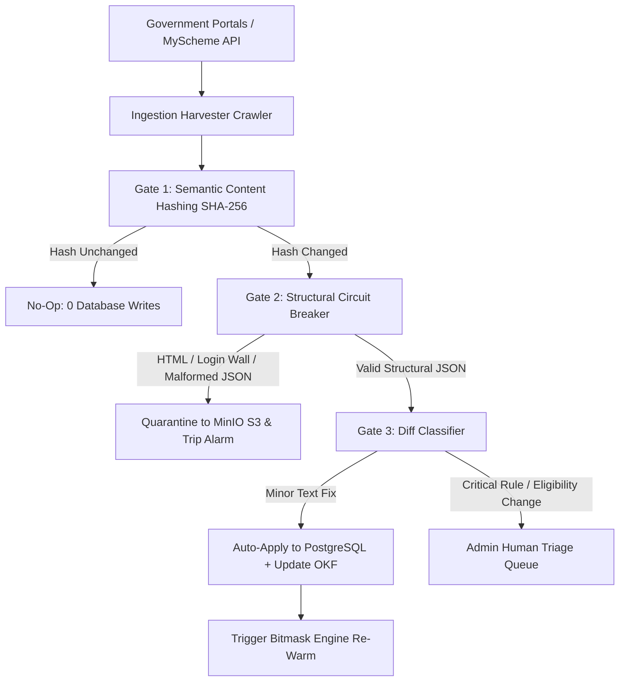

# Government Ingestion CDC & Circuit Breaker Pipeline

A resilient Change Data Capture (CDC) and automated harvesting pipeline designed to ingest, validate, and synchronize official national and state welfare schemes without corrupting production databases during upstream portal failures.

---

## 1. The Multi-Gate Defensive Pipeline



---

## 2. Gate 0: Zero-Bandwidth RFC 7232 HTTP Caching (ETag / If-Modified-Since)

Before downloading any payload, the client attaches stored HTTP cache headers:

```python
headers = {
    "User-Agent": "SchemeDiscovery-GovIngestion/1.5 (+https://schemediscovery.gov.in)",
    "Accept": "application/json",
}
if source.etag:
    headers["If-None-Match"] = source.etag
if source.last_modified_header:
    headers["If-Modified-Since"] = source.last_modified_header

resp = http_client.get(source.endpoint_url, headers=headers)

if resp.status_code == 304:
    # Source unchanged on government server: exit immediately
    return IngestionSyncRunResult(status="unchanged_304", bytes_downloaded=0)
```

---

## 3. Gate 1: Deterministic Semantic SHA-256 Hashing

To avoid expensive relational updates when non-business timestamps or whitespace fluctuate, the engine normalizes and sorts all nested criteria before computing a **canonical SHA-256 hash**:

```python
def canonicalize_scheme_payload(scheme: dict[str, Any]) -> dict[str, Any]:
    # Sort rules deterministically
    rules = sorted([
        {
            "field_name": str(r.get("field_name", "")).strip().lower(),
            "operator": str(r.get("operator", "")).strip().lower(),
            "rule_value": str(r.get("rule_value") or r.get("value_criteria") or "").strip(),
        }
        for r in scheme.get("eligibility_rules", [])
    ], key=lambda x: (x["field_name"], x["operator"], x["rule_value"]))

    # Sort benefits
    benefits = sorted([
        {
            "title": str(b.get("title") or b.get("benefit_type") or "").strip(),
            "description": str(b.get("description", "")).strip(),
        }
        for b in scheme.get("benefits", [])
    ], key=lambda x: (x["title"], x["description"]))

    # Sort required documents
    documents = sorted([
        {
            "document_name": str(d.get("document_name", "")).strip().lower(),
            "is_mandatory": bool(d.get("is_mandatory", True)),
        }
        for d in scheme.get("required_documents", [])
    ], key=lambda x: (x["document_name"], x["is_mandatory"]))

    return {
        "name": str(scheme.get("name", "")).strip(),
        "slug": str(scheme.get("slug", "")).strip().lower(),
        "ministry": str(scheme.get("ministry", "")).strip(),
        "state": str(scheme.get("state", "ALL_INDIA")).strip().upper(),
        "eligibility_rules": rules,
        "benefits": benefits,
        "required_documents": documents,
    }

def compute_semantic_hash(schemes: list[dict]) -> str:
    canonical = sorted([canonicalize_scheme_payload(s) for s in schemes], key=lambda x: x["slug"])
    canonical_json = json.dumps(canonical, sort_keys=True, separators=(",", ":"))
    return hashlib.sha256(canonical_json.encode("utf-8")).hexdigest()
```

* **The SQL Decision**: If `source.content_hash == computed_hash`, the run completes with `hash_matched_0_diff` $\to$ **0 SQL database updates executed**.


---

## 3. Gate 2: Structural Circuit Breaker & S3 Quarantine

Government portals frequently return HTTP `200 OK` while serving **HTML login walls, Cloudflare challenge captchas, or empty datasets**:

```python
def validate_payload_structure(raw_content: bytes, source_key: str) -> list[dict]:
    text = raw_content.decode("utf-8", errors="replace").strip()

    # 1. Reject HTML disguised as 200 OK (WAF / Login walls)
    if any(tag in text[:500].lower() for tag in ["<!doctype html", "<html", "<head"]):
        _quarantine_blob(raw_content, source_key, "HTML_PAYLOAD_DETECTED")
        raise CircuitBreakerError("HTML payload detected instead of JSON.")

    # 2. Syntax Validation
    try:
        data = json.loads(text)
    except Exception as e:
        _quarantine_blob(raw_content, source_key, "INVALID_JSON_SYNTAX")
        raise CircuitBreakerError(f"JSON syntax error: {e}")

    # 3. Essential Field Coverage (>50% validity check)
    schemes = extract_scheme_list(data)
    valid_count = sum(1 for s in schemes if s.get("name") and s.get("ministry"))
    if valid_count / len(schemes) < 0.5:
        _quarantine_blob(raw_content, source_key, "MISSING_ESSENTIAL_FIELDS")
        raise CircuitBreakerError("Corrupted batch: majority items missing core fields.")

    return schemes
```

* **S3 Quarantine Destination**: `s3://bucket/ingestion_quarantine/{source}/{timestamp}_{reason}.raw`

---

## 4. Gate 3: Diff Classifier & Human Triage

Changes are classified by risk tier:

| Classification | Trigger Conditions | Action |
| :--- | :--- | :--- |
| **`NO_CHANGE`** | Semantic hash matches existing record. | Discard. |
| **`MINOR_UPDATE`** | Minor description typo or application URL update. | Automatically apply to PostgreSQL and sync OKF catalog. |
| **`CRITICAL_RULE_CHANGE`** | Modified income limits, age bounds, or added required documents. | **Block auto-apply**; route to Admin Triage Queue for verification. |
| **`SCHEME_DEPRECATED`** | Scheme disappeared from upstream ministry catalog. | Mark `is_active = False` in DB (soft-delete). |

---

## 5. Related Graph Connections

- **[[In-Memory Bitmask Rule Engine Architecture|Engine: Bitmask Engine Architecture]]**: Instant reload & warm-up triggers on CDC commits.
- **[[Govt Scheme Navigator System Architecture|System: Govt Scheme Navigator]]**: Platform architecture overview.
- **[[Waalaxy Platform Architecture|Platform: Waalaxy Rate Limiting & Anti-Detection]]**: Web scraping and rate limit mitigation.
- **[[README|Master Map of Content (MOC)]]**: Root directory.
