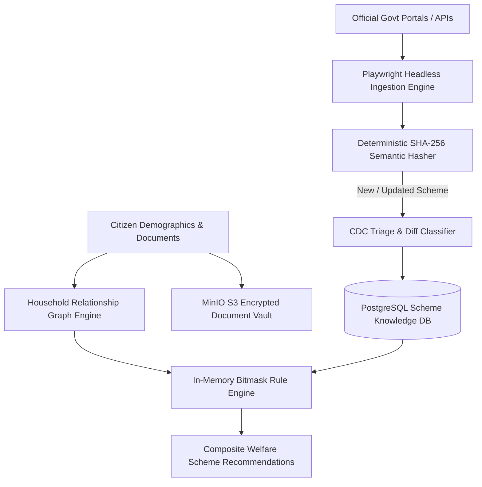

# Govt Scheme Domain Data Models & Ingestion CDC Architecture

A specialized data architecture model derived from **Scheme-Backend**, analyzing multi-source scheme scraping, change data capture (CDC), encrypted MinIO document vaults, and multi-member household eligibility graphs.

---

## 1. Scheme Ingestion and Eligibility Evaluation Pipeline



```
┌──────────────────────────────┬──────────────────────────────┬────────────────────────────────────────┐
│ Subsystem                    │ Architectural Standard       │ Failure Mode & Anti-Pattern Eliminated │
├──────────────────────────────┼──────────────────────────────┼────────────────────────────────────────┤
│ **1. Ingestion CDC**         │ SHA-256 Content Hashing      │ Eliminates duplicate scraping ingestion│
│                              │                              │ when portal markup changes cosmetic CSS│
├──────────────────────────────┼──────────────────────────────┼────────────────────────────────────────┤
│ **2. Document Vault**        │ MinIO S3 + AES-256 Storage   │ Prevents PII leaks; isolates raw PDFs  │
│                              │                              │ behind temporary presigned URLs.       │
├──────────────────────────────┼──────────────────────────────┼────────────────────────────────────────┤
│ **3. Household Graph**       │ Relational Family Tree Nodes │ Solves multi-member income aggregation │
│                              │                              │ across generational welfare benefits.  │
├──────────────────────────────┼──────────────────────────────┼────────────────────────────────────────┤
│ **4. Bitmask Evaluation**    │ Inverted Vector Bitsets      │ Sub-millisecond evaluation across      │
│                              │                              │ 4,000+ complex eligibility predicates. │
└──────────────────────────────┴──────────────────────────────┴────────────────────────────────────────┘
```

---

## 2. The Deterministic Semantic Invariant

```
CDC Semantic Hashing Formula:
Hash_scheme = SHA256(Title + Standardized_Rules + Income_Ceiling + Category + Age_Bounds)
```

> **The Welfare Discovery Invariant**: Government entitlement engines must **never evaluate individual citizens in isolation**; eligibility must be computed over the **Household Welfare Graph**, aggregating family income, land ownership, and demographic dependencies to unlock composite multi-benefit schemes.

---

## 3. Related Graph Connections

- **[[In-Memory Bitmask Rule Engine Architecture|Database: Bitmask Engine]]**: In-memory rule compilation.
- **[[Household Welfare Graph and Family Eligibility Engine|Platform: Household Welfare]]**: Graph aggregation.
- **[[Government Ingestion CDC and Circuit Breaker Pipeline|Ingestion: CDC Pipeline]]**: Harvesting resilience.
- **[[README|Master Map of Content (MOC)]]**: Root directory.
