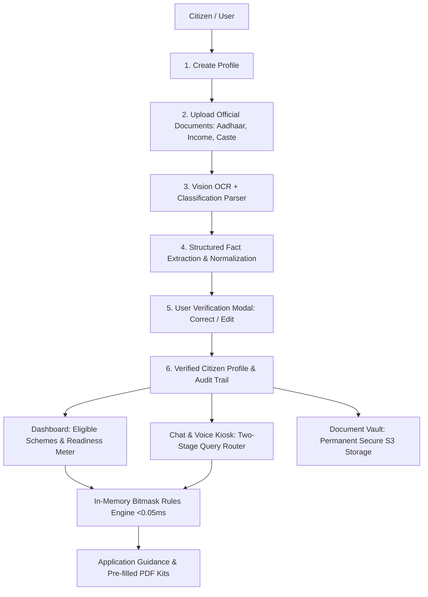
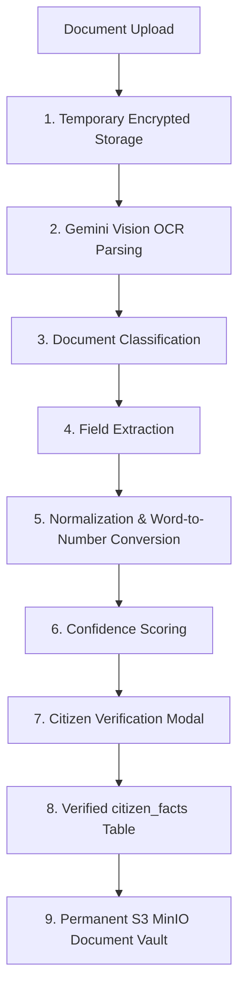
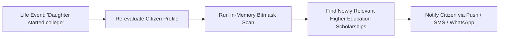
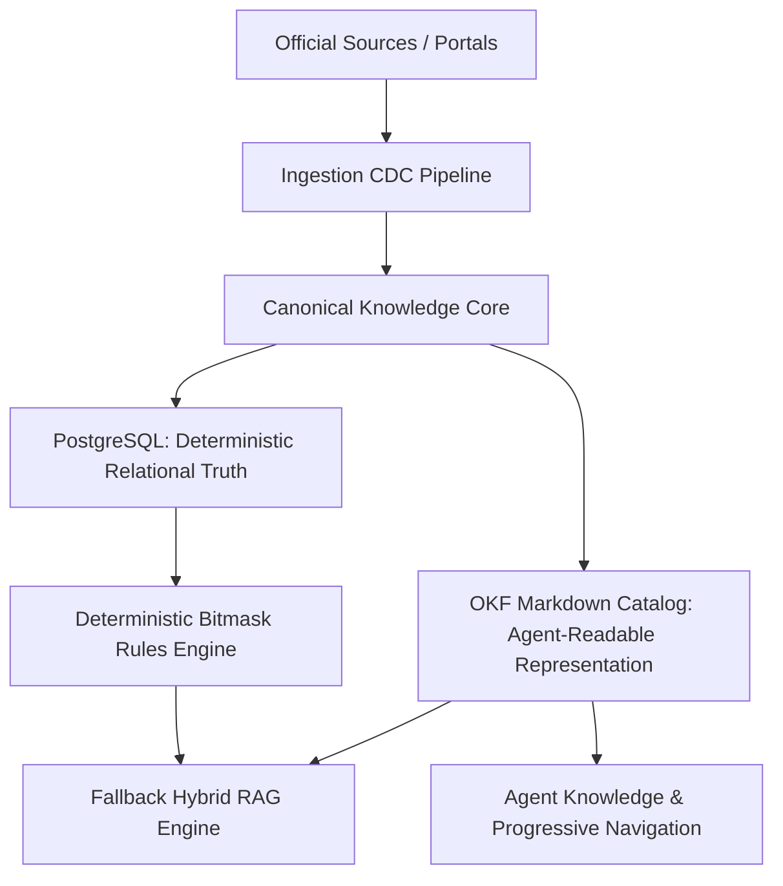
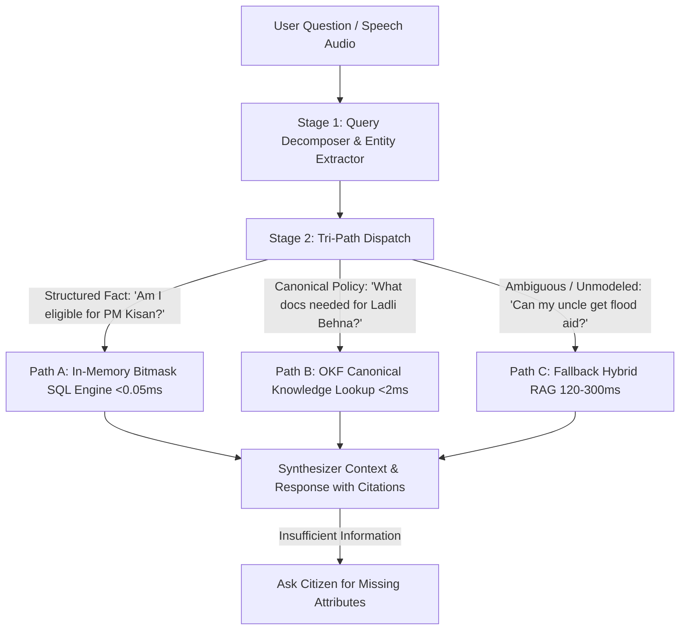
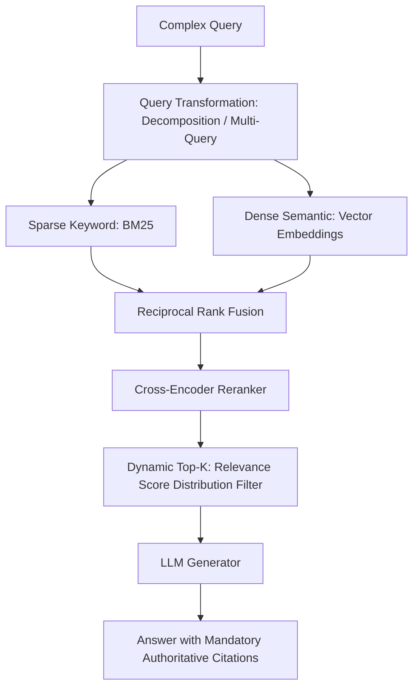

# Government Benefits Navigator — Master System Architecture

A production-grade Public Digital Infrastructure (PDI) architecture designed to continuously assist citizens in discovering, verifying, understanding, and accessing welfare benefits across national and state programs.

---

## 1. Core Promise & Fundamental Invariant

> **"A citizen gives the system their information once. The system continuously helps them discover, understand, verify, and access government benefits and services relevant to their life."**

The system answers two core questions:
1. **"What can I get?"** (Entitlements discovery & eligibility verification)
2. **"What should I do next?"** (Step-by-step document guidance & application kits)

### The 9-Line Architectural Axiom:
```text
LLM interprets.
Database stores.
Rules engine decides.
OKF represents canonical knowledge.
RAG retrieves uncertain/unstructured knowledge.
Reranker prioritizes evidence.
Citations prove claims.
Human confirms personal information.
MCP exposes capabilities to agents.
```

* **Deterministic Eligibility Invariant**: The LLM *never* evaluates scheme eligibility directly. The deterministic rules engine evaluates structured criteria ($< 0.05\text{ms}$); the LLM handles natural language interpretation, user guidance, and conversational reasoning.

---

## 2. End-to-End Citizen Experience Pipeline



---

## 3. Document Extraction & Vault Architecture



* **Verification UX**: The user is presented with extracted facts (`"We found your annual income as ₹1,80,000. [Confirm] [Edit]"`). Once confirmed, it enters the trusted profile.
* **Separation of Concerns**: The temporary OCR parsing queue is decoupled from the long-term encrypted **Document Vault**.

---

## 4. Citizen Profile: Fact-Based Decomposition & Provenance

The citizen profile is modeled as an **atomic facts graph**, not a static flat table:

```
Citizen Facts Graph
 ├── Identity (DOB, Gender, State, District, Masked Aadhaar)
 ├── Location (Rural/Urban, Domicile State)
 ├── Family (Household Members, Dependents, Marital Status)
 ├── Education (Level, Marks, Degree, Stream)
 ├── Employment (Farmer, Artisan, Student, Unemployed, MSME)
 ├── Income (Annual Household Income Ceiling)
 ├── Assets (Land Hectares, Pucca/Kutcha House, Vehicles)
 ├── Certificates (Income, Caste SC/ST/OBC, Disability)
 ├── Existing Benefits (Ration Card BPL, PM Kisan Active)
 └── Life Events (Milestone Triggers)
```

### The Provenance Audit Trail Invariant:
Every fact in `citizen_facts` is immutably linked to its origin:
$$\text{Annual Income: ₹1,80,000} \implies \text{Source: doc\_987} \implies \text{Confidence: 0.965} \implies \text{Verified by Citizen @ Timestamp}$$

---

## 5. Life-Event Intelligence Engine

Welfare discovery is proactive rather than reactive. The system registers life milestones:

```
Life Events:
• Child born                  • Started business
• Marriage                    • Bought land / crop loss
• Daughter started college    • Turned 18 (Voting / Adult schemes)
• Lost employment             • Turned 60 (Senior Citizen pensions)
```



---

## 6. Dual Canonical Knowledge Architecture: PostgreSQL & OKF



### 1. PostgreSQL (Deterministic Machine Truth)
Used for structured relational queries and bitmask rule compilation:
* `schemes`, `scheme_versions`, `eligibility_rules`, `scheme_benefits`, `required_documents`, `citizen_facts`, `household_members`.

### 2. OKF (Open Knowledge Foundation — Agent-Readable Truth)
Maintains structured Markdown files adhering to the Frictionless Data Package spec:
```
knowledge/
├── datapackage.json          # Schema validation & index metadata
├── schemes/                  # Individual scheme bibles with complete YAML headers
├── documents/                # Required certificate guidelines & authority rules
└── ministries/               # Central and state government departments
```
> [!IMPORTANT]
> **No Blind Chunking**: Canonical OKF knowledge is never blindly shredded into arbitrary RAG chunks. Its conceptual hierarchy is preserved for progressive agent navigation.

---

## 7. Two-Stage Query Router & Multi-Engine Dispatch



---

## 8. Fallback Hybrid RAG Pipeline & Evaluation Protocol

RAG is an intentional fallback for unstructured or historical edge cases, not the primary knowledge foundation.



### RAG Engineering Invariants:
1. **Dynamic K**: Simple queries receive Top-2 chunks; complex multi-part queries expand to Top-8; low-confidence distributions trigger clarifying questions.
2. **Embedding Space Compatibility**: Query and document embedding models must belong to the exact same dimension and model family.
3. **Freshness-Aware Semantic Cache**: Cache entries store `(query, embedding, answer, source_versions, expires_at)`. Upstream policy changes instantly invalidate affected cache entries.

---

## 9. Mandatory Claim Citations

Every assertion made to a citizen must be backed by verifiable provenance:

```
Answer Claim ➔ Official Source ➔ Document Name ➔ Page/Section ➔ Version Hash ➔ Last Verified Date
```
* **Citizen Verification**: Allows any user to click `"Show me where you got this"` to inspect the official gazette notification or ministry portal URL.

---

## 10. Model Context Protocol (MCP) Interface

MCP decouples internal application logic from autonomous AI agents:

```
┌────────────────────────────────────────────────────────┐
│ Autonomous AI Agent (Antigravity / Claude / Custom)    │
│        │                                               │
│        ▼                                               │
│ Model Context Protocol (MCP Server Interface)          │
│   • find_schemes(profile)                              │
│   • check_eligibility(user_id, scheme_slug)            │
│   • get_required_documents(scheme_slug)               │
│   • get_official_sources(scheme_slug)                  │
│        │                                               │
│        ▼                                               │
│ Application Services (Bitmask / PostgreSQL / OKF)      │
└────────────────────────────────────────────────────────┘
```

---

## 11. Phased Execution Roadmap (V1.0 – V4.0)

```
[Phase 1: Foundation (MP State)] ──▶ [Phase 2: 20-50 Scheme Catalog] ──▶ [Phase 3: Bitmask Engine]
                 │                                                                 │
                 ▼                                                                 ▼
[Phase 4: Benefit Dashboard] ─────▶ [Phase 5: OKF NLP Router] ────────▶ [Phase 6: Hybrid RAG]
                 │                                                                 │
                 ▼                                                                 ▼
[Phase 7: MCP Agent Tools] ───────▶ [Phase 8: Life-Event Engine] ──────▶ [Production Public Kiosk]
```

| Phase | Milestone Focus | Deliverables & Performance Targets |
| :--- | :--- | :--- |
| **Phase 1** | **Foundation (Madhya Pradesh)** | Auth, Citizen Profile, Document Upload, Gemini Vision OCR, Fact Verification Modal, S3 Vault. |
| **Phase 2** | **Scheme Knowledge Catalog** | 20–50 core schemes, eligibility criteria, benefits, required documents, OKF Markdown package. |
| **Phase 3** | **Deterministic Rules Engine** | Bitmask integer vector evaluation (< 0.05ms), explainability breakdown, readiness meter. |
| **Phase 4** | **Citizen Dashboard** | 4-tier opportunity breakdown (Eligible, Likely Eligible, Missing Docs, Future Milestones). |
| **Phase 5** | **OKF Conversational Router** | Two-Stage Query Rewriter, Indic NLP entity extraction, OKF direct lookup, Chat SSE streaming. |
| **Phase 6** | **Hybrid RAG Fallback** | BM25 + Vector + Cross-Encoder Reranker + Dynamic K + Evaluation benchmarks (NDCG, Recall@K). |
| **Phase 7** | **MCP Agent Server** | Standard MCP tool endpoints exposing backend services to external autonomous AI agents. |
| **Phase 8** | **Life-Event Intelligence** | Background milestone triggers (Turning 18, Senior 60, College) and automated notification loops. |

---

## 12. Final Locked System Topologies

```
                             CITIZEN
                                │
                                ▼
                        MOBILE / WEB APP
                                │
              ┌─────────────────┼─────────────────┐
              │                 │                 │
              ▼                 ▼                 ▼
           PROFILE          DOCUMENTS           CHAT
              │                 │                 │
              │                 ▼                 ▼
              │              OCR/PARSER      QUERY ROUTER
              │                 │                 │
              │                 ▼       ┌─────────┼─────────┐
              │          VERIFIED FACTS  │         │         │
              │                 │        ▼         ▼         ▼
              │                 │       SQL       OKF       RAG
              │                 │       Rules      │         │
              └─────────────────┼────────┴─────────┴─────────┘
                                │
                                ▼
                       RECOMMENDATION ENGINE
                                │
                  ┌─────────────┼──────────────┐
                  ▼             ▼              ▼
              DASHBOARD      CITATIONS      NEXT ACTION
                                                │
                                                ▼
                                        APPLICATION GUIDANCE
```

```
                      GOVERNMENT SOURCES
                             │
                             ▼
                      INGESTION SYSTEM
                             │
                             ▼
                    CANONICAL KNOWLEDGE
                        /                                 /                                  ▼              ▼
                 PostgreSQL          OKF
                      │              │
                      ▼              ▼
                Rules Engine    Agent Knowledge
                      │              │
                      └──────┬───────┘
                             │
                             ▼
                           RAG
                             │
                  ┌──────────┼──────────┐
                  ▼          ▼          ▼
                BM25       Vector     Reranker
                             │
                             ▼
                            MCP
                             │
                             ▼
                          AGENTS
```

---

## 13. Related Graph Connections

- **[[In-Memory Bitmask Rule Engine Architecture|Engine: Bitmask Engine Architecture]]**: Microsecond evaluation algorithms.
- **[[Government Ingestion CDC and Circuit Breaker Pipeline|Pipeline: Ingestion CDC & Circuit Breaker]]**: Data harvesting and quarantine gates.
- **[[Two-Stage Query Rewriter and Multi-Engine Router|Routing: Query Rewriter & Router]]**: Natural language tri-path query orchestration.
- **[[Document Vault and Scheme Readiness Meter|Vault: Document Vault & Readiness Meter]]**: MinIO storage and readiness scoring.
- **[[Multimodal Vision OCR and Citizen Fact Provenance|Pipeline: Vision OCR & Fact Provenance]]**: Extraction and DPDP 2023 privacy.
- **[[Voice-First Indic Kiosk Gateway Architecture|Voice: Indic Kiosk Gateway]]**: 24kHz raw PCM streaming and live tool-calling.
- **[[Household Welfare Graph and Family Eligibility Engine|Engine: Household Welfare Graph]]**: Relational multi-member welfare discovery.
- **[[Binary Serialization Architecture and Protobuf Indexing|Serialization: Protobuf & gRPC]]**: Binary index architectures.
- **[[Distributed Messaging Architecture and Event Streaming Models|Distributed: Messaging Paradigms]]**: Asynchronous task and event streaming escalation.
- **[[README|Master Map of Content (MOC)]]**: Root directory.
