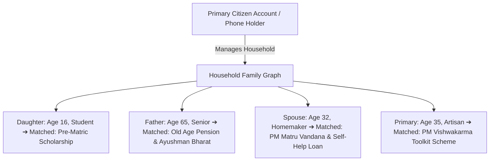

# Household Welfare Graph & Family Eligibility Engine

A relational modeling and eligibility aggregation framework that expands individual citizen welfare scanning into a **complete household dependency graph**—automatically uncovering entitlements for children, elderly parents, spouses, and dependent farmers in a single evaluation.

---

## 1. The Single-Citizen Blindspot & The Household Solution

Most government welfare applications only evaluate the individual user holding the phone. However, in low-income families, welfare entitlements belong to **dependents** (e.g. scholarship for a daughter, pension for an elderly grandmother, fertilizer subsidy for a farmer father):



---

## 2. Relational Household Schema (`household_members`)

```sql
CREATE TABLE household_members (
    id UUID PRIMARY KEY DEFAULT gen_random_uuid(),
    head_of_family_id UUID NOT NULL REFERENCES users(id) ON DELETE CASCADE,
    relationship VARCHAR(32) NOT NULL, -- self, spouse, son, daughter, father, mother
    full_name VARCHAR(128) NOT NULL,
    gender VARCHAR(16) NOT NULL,
    dob DATE NOT NULL,
    caste_category VARCHAR(32),
    occupation VARCHAR(64),
    education_level VARCHAR(64),
    is_disabled BOOLEAN NOT NULL DEFAULT FALSE,
    disability_percentage INTEGER,
    created_at TIMESTAMP WITH TIME ZONE DEFAULT NOW(),
    updated_at TIMESTAMP WITH TIME ZONE DEFAULT NOW()
);
CREATE INDEX idx_household_head ON household_members(head_of_family_id);
```

---

## 3. Aggregate Household Scan Algorithm

The engine executes parallel batch evaluations across the in-memory bitmask engine:

```python
def scan_household_welfare(db: Session, head_user_id: UUID) -> dict[str, Any]:
    members = db.query(HouseholdMember).filter_by(head_of_family_id=head_user_id).all()
    head_user = db.query(User).filter_by(id=head_user_id).first()

    household_results = []
    total_benefits_value = 0

    for member in members:
        # Build individual member profile, inheriting shared family attributes (State, Total Household Income)
        member_profile = {
            "state": head_user.state,
            "annual_income": head_user.annual_income, # Shared household income ceiling
            "gender": member.gender,
            "age": calculate_age(member.dob),
            "caste_category": member.caste_category or head_user.caste_category,
            "occupation": member.occupation,
            "is_disabled": member.is_disabled,
        }

        # Fast bitwise evaluation (< 0.05ms)
        matched_schemes = bitmask_engine.evaluate(member_profile)

        household_results.append({
            "member_id": str(member.id),
            "name": member.full_name,
            "relationship": member.relationship,
            "eligible_count": len(matched_schemes),
            "schemes": matched_schemes,
        })

    return {
        "head_of_family": head_user.full_name,
        "total_household_members": len(members),
        "total_matched_schemes": sum(m["eligible_count"] for m in household_results),
        "breakdown_by_member": household_results,
    }
```

---

## 4. Architectural Invariants

1. **Shared vs. Individual Facts**: Certain attributes are shared across the household (e.g. `state`, `annual_income`, `ration_card_type`), while others are strictly individual (`age`, `gender`, `education_level`, `disability`).
2. **Duplicate Benefit Deduplication**: Schemes restricted to "one benefit per household" (e.g. PM Awas Yojana) flag household collisions if multiple members attempt concurrent applications.

---

## 5. Related Graph Connections

- **[[In-Memory Bitmask Rule Engine Architecture|Engine: Bitmask Engine Architecture]]**: Underlying vector calculation engine.
- **[[Govt Scheme Navigator System Architecture|System: Govt Scheme Navigator]]**: Platform architecture master overview.
- **[[Multimodal Vision OCR and Citizen Fact Provenance|Pipeline: Vision OCR & Fact Provenance]]**: Automatic ingestion of family ration cards and dependent birth certificates.
- **[[README|Master Map of Content (MOC)]]**: Root directory.
