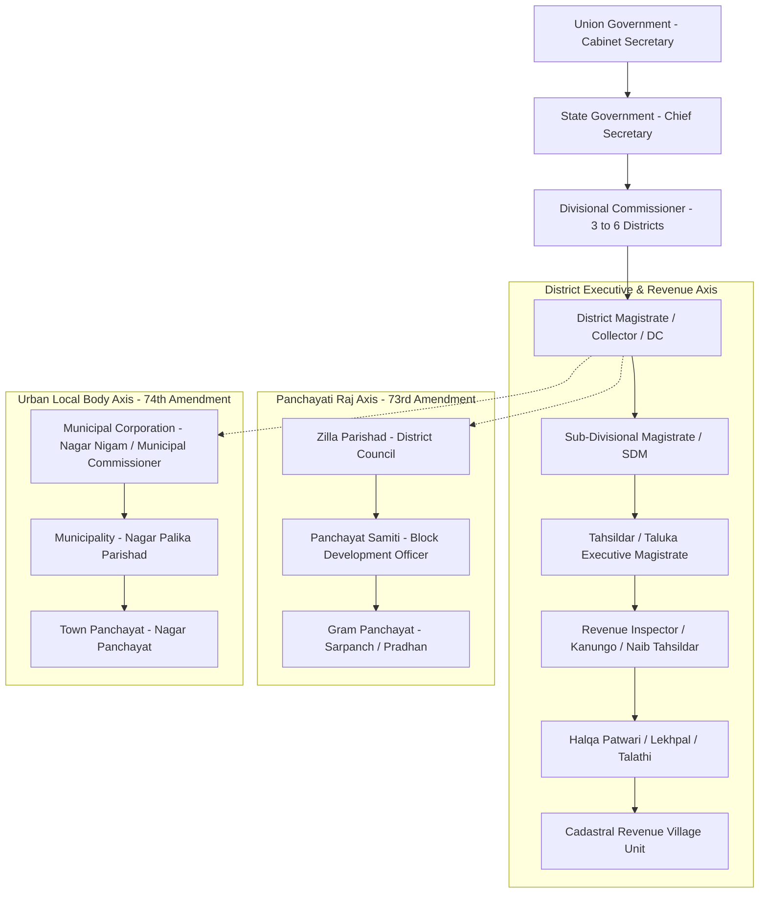

# Indian Administrative Hierarchy and Fiscal Revenue Architecture

A rigorous structural analysis of the **Indian administrative apparatus**, the **cadastral land revenue record pipeline**, and the **macro-infrastructure scaling invariants** governing nationwide energy and data grid deployments.

---

## 1. The Vertical Administrative & Revenue Pipeline

The governance of the Indian union is structured as a hierarchical pipeline designed for law enforcement, revenue collection, land record custody, and welfare distribution across ~1.4 billion citizens:

```
┌────────────────────────────────────────────────────────────────────────────┐
│                  INDIAN REVENUE & ADMINISTRATIVE TREE                      │
├───────────────────┬───────────────────────────┬────────────────────────────┤
│ JURISDICTION LEVEL│ EXECUTIVE DESIGNATION     │ PRIMARY STATUTORY ROLE     │
├───────────────────┼───────────────────────────┼────────────────────────────┤
│ **Union (Nation)**│ Cabinet Secretary / PMO   │ Central policy & ministries│
├───────────────────┼───────────────────────────┼────────────────────────────┤
│ **State / UT**    │ Chief Secretary / ACS     │ State administration & law │
├───────────────────┼───────────────────────────┼────────────────────────────┤
│ **Division**      │ Divisional Commissioner   │ Appellate revenue court &  │
│ (Group of 3–6 Dists)│                         │ inter-district supervision │
├───────────────────┼───────────────────────────┼────────────────────────────┤
│ **District**      │ District Magistrate (DM) /│ Supreme executive authority│
│ (~788–800 Total)  │ Collector / Dy Commissioner│ Law & order (CrPC), Revenue│
├───────────────────┼───────────────────────────┼────────────────────────────┤
│ **Sub-Division**  │ Sub-Divisional Magistrate │ Executive Magistrate; land │
│                   │ (SDM) / Sub-Collector     │ dispute adjudication       │
├───────────────────┼───────────────────────────┼────────────────────────────┤
│ **Tehsil / Taluk**│ Tahsildar / Mamlatdar     │ Head of Revenue Court;     │
│                   │                           │ land mutation & certificates│
├───────────────────┼───────────────────────────┼────────────────────────────┤
│ **Revenue Circle**│ Naib Tahsildar / Revenue  │ Field supervision of land  │
│ / Sub-Tehsil      │ Inspector (RI) / Kanungo  │ boundaries and crop records│
├───────────────────┼───────────────────────────┼────────────────────────────┤
│ **Halqa / Patwar**│ Patwari / Lekhpal /       │ Micro-custodian of Village │
│                   │ Talathi / Village Officer │ Cadastral Maps & Khasra    │
├───────────────────┼───────────────────────────┼────────────────────────────┤
│ **Revenue Village**│ Gram Sabha / Village      │ Base cadastral parcel unit │
└───────────────────┴───────────────────────────┴────────────────────────────┘
```



---

## 2. Dual-Track Governance: Executive vs Local Self-Government

Following the **73rd and 74th Constitutional Amendment Acts (1992)**, Indian administration bifurcated into two parallel, interacting hierarchies:

1. **The Bureaucratic Revenue & Magisterial Track**:
   * Appointed civil servants (IAS, State Administrative Services, Revenue Cadres).
   * Holds coercive powers under the Criminal Procedure Code (CrPC / BNSS) and state Land Revenue Codes.
   * Maintains immutable land titles, enforces tax/stamp duty collection, and directs district disaster response.
2. **The Democratic Decentralized Track (Panchayati Raj & ULBs)**:
   * Elected representatives (Sarpanch, Ward Members, Mayors) advised by administrative secretaries (Panchayat Secretary, BDO, Municipal Commissioner).
   * Responsible for 29 rural subjects (11th Schedule) and 18 urban subjects (12th Schedule) including local sanitation, primary education, rural roads, and water supply.

---

## 3. Cadastral Land Record Systems & Fiscal Invariants

Land revenue administration relies on a standardized, multi-century record architecture:

```
┌────────────────────────────────────────────────────────────────────────────┐
│                    CADASTRAL LAND RECORD ARTIFACTS                         │
├───────────────────┬────────────────────────────────────────────────────────┤
│ DOCUMENT          │ RECORDED FISCAL & GEOSPATIAL PARAMETERS                │
├───────────────────┼────────────────────────────────────────────────────────┤
│ **Shajra**        │ Geo-referenced cadastral map detailing exact parcel    │
│                   │ boundaries, khasra numbers, roads, canals, and wells   │
├───────────────────┼────────────────────────────────────────────────────────┤
│ **Khasra**        │ Field Book index documenting ownership, soil type,     │
│ (Field Register)  │ crop cultivation patterns, irrigation status, and trees│
├───────────────────┼────────────────────────────────────────────────────────┤
│ **Khatauni**      │ Record of Rights (RoR) organizing parcels by landholder;│
│ (Record of Rights)│ details total acreage, co-sharer fractions, mortgages  │
├───────────────────┼────────────────────────────────────────────────────────┤
│ **Dakhil-Kharij** │ Statutory legal transfer of land title in revenue books│
│ (Mutation)        │ following sale deeds, inheritance, gift, or court decree│
├───────────────────┼────────────────────────────────────────────────────────┤
│ **Jamabandi**     │ Quadrennial revised master register of land titles,    │
│                   │ rents, and land revenue liabilities                    │
└───────────────────┴────────────────────────────────────────────────────────┘
```

* **The Mutation Invariant**: A registered sale deed at the Sub-Registrar Office (Registration Act) only creates legal evidence of a transaction; **mutation (Dakhil-Kharij)** before the Tahsildar is strictly required to update the state fiscal register (Khatauni) for property tax assessment and ownership recognition.

---

## 4. Macro Energy Infrastructure & 788-District Backbone Topology

Long-term sovereign planning requires aligning administrative boundaries with high-voltage physical energy networks capable of powering advanced industrialization, high-density AI data centers, and urban transport electrification.

```
                  DISTRICT-TO-GRID TOPOLOGY COMPARISON

    [Brittle Radial Distribution]               [Resilient Mesh Backbone]
        (Single Point of Failure)                 (Redundant Multi-Path)

             (Power Plant)                             [Hub A] ─────── [Hub B]
                   │                                      │   \       /   │
          ┌────────┴────────┐                             │    \     /    │
          ▼                 ▼                             │     [Hub C]   │
     [District 1]      [District 2]                       │    /     \    │
          │                 │                             │   /       \   │
          ▼                 ▼                          [Hub D] ─────── [Hub E]
     [District 3]      [District 4]
```

### 4.1 Long-Horizon Electricity Demand Model (2026 vs 2100)
* **Current Baseline**: ~2,000+ TWh/year total consumption; ~250–300 GW peak demand.
* **Industrialized Target (2100)**: 6,000–10,000 TWh/year (matching developed per-capita benchmarks of $4,000\text{--}7,000\text{ kWh/capita/yr}$).

$$\text{Annual Energy Output per 1 GW Reactor} = 1\text{ GW} \times 0.90 \ (\text{Capacity Factor}) \times 8760\text{ hours} \approx 7.884\text{ TWh/year}$$

$$\text{Reactors Required for } 8,000\text{ TWh} = \frac{8000\text{ TWh/year}}{7.884\text{ TWh/reactor-year}} \approx 1015\text{ GW-Scale Reactors}$$

### 4.2 Multi-Criteria Optimization Matrix for Nuclear & Compute Node Siting

```
┌────────────────────────────────────────────────────────────────────────────┐
│             INFRASTRUCTURE SITE OPTIMIZATION SCORING MATRIX                │
├───────────────────────────┬────────┬───────────────────────────────────────┤
│ SITING PARAMETER          │ WEIGHT │ ENGINEERING & SAFETY RATIONALE        │
├───────────────────────────┼────────┼───────────────────────────────────────┤
│ **Cooling Water Sink**    │ 25%    │ Coastal ocean / major perennial river │
│                           │        │ for continuous thermal dissipation    │
├───────────────────────────┼────────┼───────────────────────────────────────┤
│ **Geological Stability**  │ 25%    │ Sited in Seismic Zone II or III;      │
│                           │        │ zero active fault-line proximity      │
├───────────────────────────┼────────┼───────────────────────────────────────┤
│ **HV Transmission Access**│ 20%    │ <50 km to 765 kV AC / ±800 kV HVDC    │
│                           │        │ interstate transmission lines (I²R min│
├───────────────────────────┼────────┼───────────────────────────────────────┤
│ **AI Data Center Proximity│ 15%    │ Low-latency fiber backbone to high-   │
│ & Industrial Corridors**  │        │ density compute clusters (0.5–1 GW)   │
├───────────────────────────┼────────┼───────────────────────────────────────┤
│ **Population Buffer Zone**│ 15%    │ 1.6 km exclusion zone; 16 km emergency│
│                           │        │ planning zone away from megacities    │
└───────────────────────────┴────────┴───────────────────────────────────────┘
```

---

## 5. Urban Concentration & Skyscraper Density Invariants

Global urbanization trends reflect high vertical clustering in constrained coastal territories, concentrating administrative, fiscal, and computational capital:

```
┌────────────────────────────────────────────────────────────────────────────┐
│                    GLOBAL SKYSCRAPER DENSITY TOPOLOGY                      │
├───────┬───────────────────┬───────────┬────────────────────────────────────┤
│ RANK  │ METROPOLIS        │ COUNTRY   │ SKYSCRAPERS (≥150m TALL)           │
├───────┼───────────────────┼───────────┼────────────────────────────────────┤
│ 1     │ **Hong Kong**     │ China     │ ~569 (Severe mountain/island constr│
├───────┼───────────────────┼───────────┼────────────────────────────────────┤
│ 2     │ **Shenzhen**      │ China     │ ~444 (Tech manufacturing core)     │
├───────┼───────────────────┼───────────┼────────────────────────────────────┤
│ 3     │ **New York City** │ USA       │ ~317 (Global financial capital)    │
├───────┼───────────────────┼───────────┼────────────────────────────────────┤
│ 4     │ **Dubai**         │ UAE       │ ~270 (Middle Eastern trade nexus)  │
├───────┼───────────────────┼───────────┼────────────────────────────────────┤
│ 5     │ **Guangzhou**     │ China     │ ~204 (Pearl River Delta hub)       │
└───────┴───────────────────┴───────────┴────────────────────────────────────┘
```

* **The Vertical Density Invariant**: High skyscraper counts emerge from high land cost, geographic boundaries (islands/harbors), and rapid GDP density, requiring high-reliability underground electrical distribution rings and massive chiller cooling capacities.

---

## 6. Related Graph Connections

- **[[Govt Scheme Navigator System Architecture]]**: Production integration with Indian public digital infrastructure, document aliases, and welfare eligibility engines.
- **[[Critical Infrastructure Grid Resilience and Industrial Automation Architecture]]**: Electrical power transmission thermodynamics ($I^2R$ minimization) and Purdue SCADA network isolation.
- **[[Biological Allometric Scaling and Square-Cube Invariants]]**: Volumetric scaling and power distribution mechanics across geographic networks.
- **[[North Indian Cooking Fundamentals and Spicing Architecture]]**: Agrarian land use, regional crop yields, and seasonal food systems.
- **[[README|Master Map of Content (MOC)]]**: Central scientific and engineering knowledge base registry.
