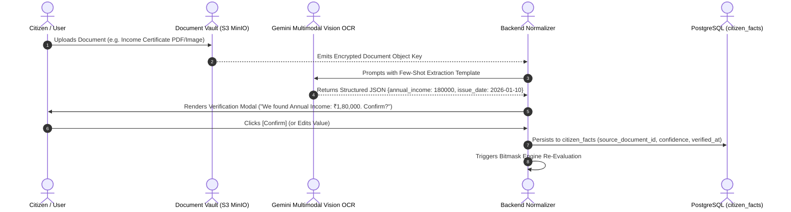

# Multimodal Vision OCR & Citizen Fact Provenance

A secure document ingestion and automated fact-extraction pipeline that converts unstructured government certificates into verified, machine-readable citizen attributes with **full audit provenance** and **DPDP 2023 data protection compliance**.

---

## 1. The Fact Extraction & Verification Lifecycle



---

## 2. Supported Certificate Extraction Schemas

| Certificate Type | Extracted Fact Keys | Validation & Normalization Rules |
| :--- | :--- | :--- |
| **Aadhaar Card** | `gender`, `dob`, `state`, `district`, `pincode` | Mask first 8 digits (`XXXX-XXXX-1234`); parse age from DOB. |
| **Income Certificate** | `annual_income`, `issuing_authority`, `valid_until` | Convert words (e.g. "One Lakh Eighty Thousand") to numeric integer `180000`. |
| **Caste Certificate** | `caste_category` (SC/ST/OBC/General), `sub_caste` | Standardize category against central OBC/SC/ST reservation lists. |
| **Marksheet / Degree** | `education_level`, `percentage`, `passing_year` | Normalize degree title (e.g. "12th Standard", "B.Tech"). |
| **Land Record (Khasra)**| `land_hectares`, `irrigation_type` | Convert local units (Bigha, Guntha, Acre) to standard Hectares. |

---

## 3. Database Provenance Schema (`citizen_facts`)

Facts are never stored as opaque unverified blobs in a generic user table. Every fact maintains a complete provenance ledger:

```sql
CREATE TABLE citizen_facts (
    id UUID PRIMARY KEY DEFAULT gen_random_uuid(),
    user_id UUID NOT NULL REFERENCES users(id) ON DELETE CASCADE,
    fact_key VARCHAR(64) NOT NULL,
    fact_value TEXT NOT NULL,
    fact_type VARCHAR(32) NOT NULL, -- string, number, boolean, date
    source_document_id UUID REFERENCES user_documents(id) ON DELETE SET NULL,
    confidence_score NUMERIC(4, 3) NOT NULL, -- e.g. 0.965
    verified_by_user BOOLEAN NOT NULL DEFAULT FALSE,
    verified_at TIMESTAMP WITH TIME ZONE,
    created_at TIMESTAMP WITH TIME ZONE DEFAULT NOW(),
    updated_at TIMESTAMP WITH TIME ZONE DEFAULT NOW(),
    UNIQUE(user_id, fact_key)
);
CREATE INDEX idx_citizen_facts_lookup ON citizen_facts(user_id, fact_key);
```

---

## 4. DPDP 2023 Compliance & Aadhaar Privacy

* **Aadhaar Redaction Invariant**: Storage of raw 12-digit Aadhaar numbers is prohibited under the Aadhaar Act and DPDP Act 2023. The OCR service immediately masks the first 8 digits in memory before persistence:
  $$\text{Aadhaar Masking}: \quad 8492\ 3847\ 1234 \implies \text{XXXX-XXXX-1234}$$
* **Granular Consent Revocation**: When a citizen deletes a document from their vault, the system detaches the document foreign key (`source_document_id = NULL`) while maintaining the user's explicit confirmed profile facts unless specifically requested to purge.

---

## 5. Related Graph Connections

- **[[Govt Scheme Navigator System Architecture|System: Govt Scheme Navigator]]**: Platform architecture overview.
- **[[In-Memory Bitmask Rule Engine Architecture|Engine: Bitmask Engine Architecture]]**: Real-time evaluation of verified citizen facts.
- **[[Household Welfare Graph and Family Eligibility Engine|Engine: Household Welfare Graph]]**: Aggregating family member facts.
- **[[README|Master Map of Content (MOC)]]**: Root directory.
