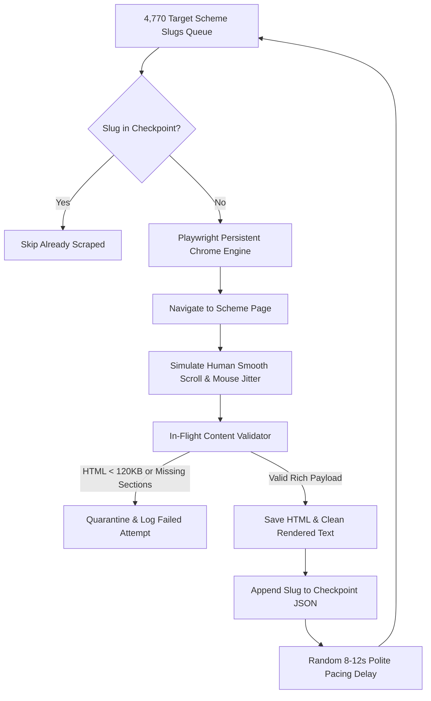

# Stealth Harvester & Anti-Bot Crawler Architecture

A production web scraping engine designed to reliably harvest thousands of dynamic JavaScript-rendered government portals (e.g. MyScheme) while bypassing anti-bot challenges and preventing empty shell writes.

---

## 1. The Stealth Harvesting Pipeline



---

## 2. Persistent Chrome Engine vs. Headless Detection

Government firewalls easily detect standard headless automation (`navigator.webdriver = true`). The harvester eliminates these flags by launching a **persistent local Chrome instance**:

```python
async def launch_stealth_browser():
    playwright = await async_playwright().start()
    context = await playwright.chromium.launch_persistent_context(
        user_data_dir=USER_DATA_DIR,
        headless=False,
        channel="chrome",
        args=[
            "--disable-blink-features=AutomationControlled",
            "--no-sandbox",
            "--disable-infobars",
        ],
        user_agent=random.choice(USER_AGENTS),
        viewport={"width": 1920, "height": 1080},
    )
    return context
```

---

## 3. In-Flight Content Validation Gate

Dynamic single-page applications (SPAs) often return HTTP 200 while rendering an empty skeleton or a "Page Not Found" modal. Before saving to disk, the crawler validates semantic payload density:

```python
def validate_scraped_scheme_payload(content_html: str, text: str) -> tuple[bool, str]:
    # 1. Structural Payload Size
    if len(content_html) < 120_000:
        return False, f"HTML size too small ({len(content_html)/1024:.1f} KB < 120 KB)"
    if len(text) < 3_000:
        return False, f"Text payload too short ({len(text)} chars < 3000 chars)"

    # 2. Mandatory Core Sections Presence
    text_lower = text.lower()
    required_sections = ["benefit", "eligib", "document", "process"]
    missing = [s for s in required_sections if s not in text_lower]
    if missing:
        return False, f"Missing critical sections: {missing}"

    # 3. Reject Error Shells
    if "404" in text_lower or "page not found" in text_lower or "access denied" in text_lower:
        return False, "Error or Access Denied page detected"

    return True, "Payload Valid"
```

---

## 4. Rate Limiting & Checkpoint Fault Recovery

* **Polite Pacing**: Injects a randomized $8	ext{--}12	ext{s}$ sleep between requests with human-like scrolling to respect government server bandwidth.
* **Atomic Checkpointing**: Saves progress to `crawler_checkpoint.json` after every successful page write, allowing seamless recovery after crashes or network drops without re-scraping thousands of pages.

---

## 5. Related Graph Connections

- **[[Government Ingestion CDC and Circuit Breaker Pipeline|Pipeline: Ingestion CDC & Circuit Breaker]]**: Downstream processor of raw harvested dumps.
- **[[Govt Scheme Navigator System Architecture|System: Govt Scheme Navigator]]**: Platform architecture overview.
- **[[Waalaxy Platform Architecture|Platform: Waalaxy Rate Limiting & Anti-Detection]]**: Advanced anti-detection heuristics.
- **[[README|Master Map of Content (MOC)]]**: Root directory.
