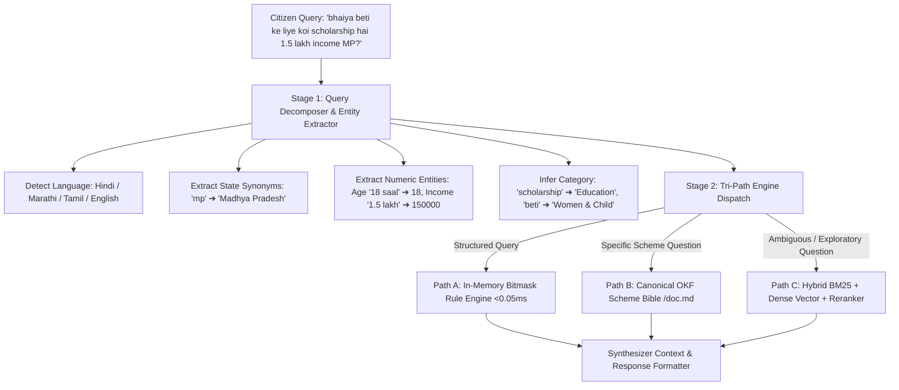

# Two-Stage Query Rewriter & Multi-Engine Router

An intelligent query orchestration system that transforms unstructured multilingual citizen questions into structured search intents, dynamically dispatching queries across **Deterministic SQL/Bitmask Rules**, **Canonical OKF Markdown**, and **Fallback Hybrid RAG**.

---

## 1. The Two-Stage Orchestration Pipeline



---

## 2. Stage 1: Entity & Constraint Extraction

The router normalizes linguistic variations and parses citizen attributes:

```python
class IntelligentQueryRouter:
    def decompose_query(self, raw_query: str, user_profile: dict | None = None) -> DecomposedQueryPlan:
        q = raw_query.lower().strip()

        # 1. State Synonym Resolution ('mp' -> 'Madhya Pradesh', 'mh' -> 'Maharashtra')
        matched_state = resolve_state_synonyms(q) or (user_profile.get("state") if user_profile else None)

        # 2. Linguistic Number Parsing ('1.5 lakh' -> 150,000; '50 hazar' -> 50,000)
        extracted_income = parse_indic_currency(q) or (user_profile.get("annual_income") if user_profile else None)
        extracted_age = parse_age_string(q) or (user_profile.get("age") if user_profile else None)

        # 3. Category & Scheme Mapping ('kisan' -> 'Agriculture', 'ayushman' -> 'ab-pmjay')
        matched_slugs = match_scheme_keywords(q)
        category = infer_broad_category(q)

        return DecomposedQueryPlan(
            original_query=raw_query,
            detected_language=detect_lang(q),
            state=matched_state,
            age=extracted_age,
            annual_income=extracted_income,
            category=category,
            matched_scheme_slugs=matched_slugs,
        )
```

---

## 3. Stage 2: Tri-Path Dispatch Logic

| Query Characteristic | Dispatch Target | Underlying Mechanism | Latency |
| :--- | :--- | :--- | :--- |
| **"What schemes am I eligible for?"** (Fact-based eligibility) | **Path A: In-Memory Bitmask SQL** | Executes bitwise AND over inverted bitsets in process RAM. | **$< 0.05\text{ms}$** |
| **"What documents do I need for PM Kisan?"** (Canonical Policy) | **Path B: Canonical OKF Layer** | Direct lookup of `knowledge/schemes/{slug}.md` without RAG chunking. | **$< 2\text{ms}$** |
| **"Can my uncle get compensation if his crops failed?"** (Exploratory) | **Path C: Hybrid RAG Fallback** | BM25 keyword search + Vector embeddings + Cross-Encoder reranking. | **$120\text{--}300\text{ms}$** |

---

## 4. Synthesizer Context Assembly

When returning answers, the synthesizer injects **strict claim citations**:
```json
{
  "route_taken": "okf_canonical",
  "matched_schemes": ["pm-kisan"],
  "canonical_sources": [
    {
      "source_title": "PM Kisan Samman Nidhi Operational Guidelines",
      "file_path": "knowledge/schemes/agriculture/pm-kisan.md",
      "official_portal": "https://pmkisan.gov.in"
    }
  ]
}
```

---

## 5. Related Graph Connections

- **[[In-Memory Bitmask Rule Engine Architecture|Engine: Bitmask Rule Engine]]**: Primary execution engine for Path A.
- **[[Govt Scheme Navigator System Architecture|System: Govt Scheme Navigator]]**: Platform architecture overview.
- **[[Voice-First Indic Kiosk Gateway Architecture|Voice: Indic Kiosk Gateway]]**: Upstream consumer of the query router.
- **[[README|Master Map of Content (MOC)]]**: Root directory.
