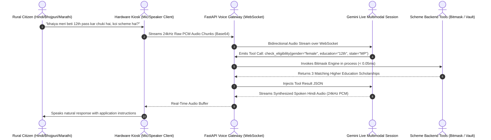

# Voice-First Indic Kiosk Gateway Architecture

A low-latency, full-duplex **Voice-First AI Gateway** designed for rural Common Service Centers (CSCs) and low-literacy citizens, streaming 24kHz raw audio and executing autonomous backend tool calls in real time.

---

## 1. System Topology & Audio Pipeline



---

## 2. Audio Processing & Gateway Invariants

```
┌────────────────────────────────────────────────────────────────────────┐
│                   AUDIO PIPELINE SPECIFICATION                         │
├─────────────────────┬──────────────────────────────────────────────────┤
│ Sampling Rate       │ 24,000 Hz (24kHz) Linear PCM                     │
│ Audio Channels      │ 1 (Mono)                                         │
│ Bit Depth           │ 16-bit Signed Little-Endian                      │
│ Frame Buffer Size   │ 512 bytes / 21.3ms chunks                        │
│ Transport Protocol  │ Full-Duplex WebSocket (`/api/v1/voice/live-ws`)  │
│ Tool Execution Time │ < 10ms (In-Memory Bitmask Rule Engine)           │
│ End-to-End Latency  │ ~450ms Speech-to-Speech Response                 │
└─────────────────────┴──────────────────────────────────────────────────┘
```

---

## 3. Registered Tool Contracts for Autonomous Voice Agents

The voice gateway exposes strictly typed, schema-validated tools that the LLM invokes autonomously during the conversation:

```python
# Registered in app/modules/voice/tools.py
VOICE_TOOLS = [
    {
        "name": "check_scheme_eligibility",
        "description": "Finds all eligible government welfare schemes for a citizen.",
        "parameters": {
            "type": "object",
            "properties": {
                "state": {"type": "string", "description": "Indian state (e.g. Madhya Pradesh, Maharashtra)"},
                "gender": {"type": "string", "enum": ["male", "female", "transgender"]},
                "caste_category": {"type": "string", "enum": ["General", "OBC", "SC", "ST"]},
                "occupation": {"type": "string", "description": "Occupation (e.g. farmer, student, artisan)"},
                "age": {"type": "integer", "description": "Citizen age in years"},
                "annual_income": {"type": "number", "description": "Annual household income in Rupees"},
            },
            "required": ["state", "gender"],
        },
    },
    {
        "name": "get_required_documents",
        "description": "Returns the mandatory documents needed to apply for a specific scheme.",
        "parameters": {
            "type": "object",
            "properties": {
                "scheme_slug": {"type": "string", "description": "Unique scheme identifier slug"}
            },
            "required": ["scheme_slug"],
        },
    },
]
```

---

## 4. CSC Kiosk Multi-Citizen Session Isolation

* **Stateless Audio Handshake**: At the end of a citizen interaction at a Common Service Center (CSC), the WebSocket closes, and in-memory audio buffers are immediately flushed.
* **VLE Authentication**: Village Level Entrepreneurs (VLEs) authenticate the terminal once; subsequent citizen voice sessions operate within ephemeral, isolated sub-sessions to prevent cross-citizen data leakage.

---

## 5. Related Graph Connections

- **[[In-Memory Bitmask Rule Engine Architecture|Engine: In-Memory Bitmask Engine]]**: Sub-millisecond tool execution target for voice loops.
- **[[Govt Scheme Navigator System Architecture|System: Govt Scheme Navigator]]**: Platform architecture overview.
- **[[Multimodal Vision OCR and Citizen Fact Provenance|Pipeline: Vision OCR & Fact Provenance]]**: Verification of documents referenced via voice.
- **[[README|Master Map of Content (MOC)]]**: Root directory.
