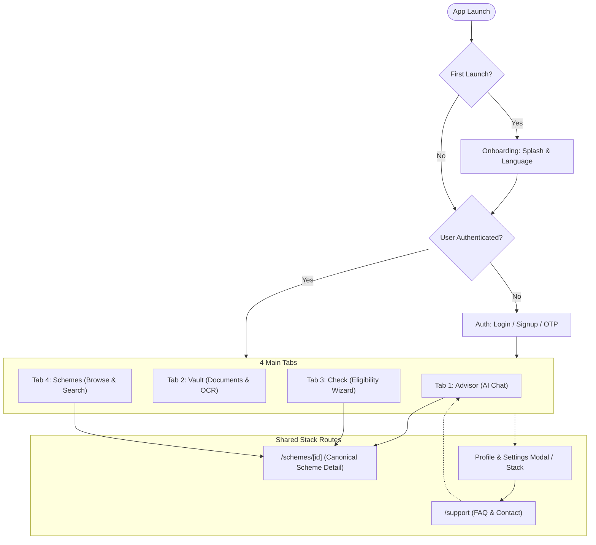
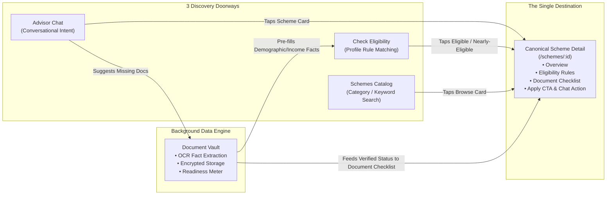

# 📱 Mobile App Screen Inventory & Navigation Architecture Plan

> **Verification Status:** ✅ **VERIFIED TRUE.**  
> Audited against all 10 design boards in [`mobile/screen/`](file:///home/neon/programs/side_project/scheme-backend/mobile/screen).  
> **Total states:** 81 designed frames.  
> **Unique core screens:** 48 screens (when collapsing micro-states, error banners, and modal sheets).

---

## 📊 1. Verified Screen Inventory

| Flow Group | Source Board | Total States | Core Screens | Key Screens & States |
| :--- | :--- | :---: | :---: | :--- |
| **1. Onboarding** | [`01_onboarding_first_launch_flow.png`](file:///home/neon/programs/side_project/scheme-backend/mobile/screen/01_onboarding_first_launch_flow.png) | 2 | 2 | Splash Screen, Language Selection (`en` / `hi`). |
| **2. Auth (Core)** | [`07_auth_and_profile_menu_flow.png`](file:///home/neon/programs/side_project/scheme-backend/mobile/screen/07_auth_and_profile_menu_flow.png) | 7 | 4 | Auth Choice (Google/Phone/Email), Phone Input, Channel Select (WhatsApp/SMS/Telegram), OTP Entry, Success Modal, Profile Completion. |
| **3. Auth (Errors & Failures)** | [`08_auth_error_and_failure_states.png`](file:///home/neon/programs/side_project/scheme-backend/mobile/screen/08_auth_error_and_failure_states.png) | 13 | 4 | Inline validation, Wrong OTP, Expired OTP, Network Offline fallback, Duplicate Account, Lockout/Rate-limit, Retry Recovery. |
| **4. Profile & Settings (Core)** | [`07_auth_and_profile_menu_flow.png`](file:///home/neon/programs/side_project/scheme-backend/mobile/screen/07_auth_and_profile_menu_flow.png) | 6 | 5 | Profile Drawer Menu, Profile Overview, Edit Profile, Linked Accounts, Settings Screen, Logout Dialog. |
| **5. Account Security & Missing Flows** | [`09_account_security_and_settings_flows.png`](file:///home/neon/programs/side_project/scheme-backend/mobile/screen/09_account_security_and_settings_flows.png) | 15 | 8 | Link Account (Email/Phone), Change Password (Form + Success), Forgot Password (Email + OTP + Reset + Success), Delete Account (Warning + Confirm string + Progress + Done). |
| **6. Help & Support** | [`10_help_and_support_flow.png`](file:///home/neon/programs/side_project/scheme-backend/mobile/screen/10_help_and_support_flow.png) | 3 | 2 | FAQ Accordion & Category Filter, Contact Channels (WhatsApp/Email/Hours), Handoff to Advisor. |
| **7. Advisor (AI Chat)** | [`02_advisor_ai_chat_flow.png`](file:///home/neon/programs/side_project/scheme-backend/mobile/screen/02_advisor_ai_chat_flow.png) | 6 | 3 | Welcome + Prompt Chips, Voice Listening Modal, Thinking Indicator, Chat Thread + Scheme Cards + Sources, Vault Redirect. |
| **8. Vault (Document Manager)** | [`05_vault_document_flow.png`](file:///home/neon/programs/side_project/scheme-backend/mobile/screen/05_vault_document_flow.png) | 10 | 5 | Vault Dashboard, Scheme Readiness Breakdown, Document Upload Sheet (Camera/Gallery/File), AI OCR Extraction & Fact Verification, Saved Celebration, Manage Context Menu, 3 Empty States. |
| **9. Check Eligibility (Wizard)** | [`04_check_eligibility_step_by_step.png`](file:///home/neon/programs/side_project/scheme-backend/mobile/screen/04_check_eligibility_step_by_step.png) | 11 | 9 | Wizard Intro, Step 1 (Demographics), Step 2 (Economic), Step 3 (Assets/Others), Review Details, Calculation Spinner, Results Summary, Eligible Schemes List, Nearly-Eligible Cards, Next Steps Action Plan. |
| **10. Schemes (Browse & Search)** | [`03_schemes_browse_and_discover_flow.png`](file:///home/neon/programs/side_project/scheme-backend/mobile/screen/03_schemes_browse_and_discover_flow.png)<br>[`06_schemes_search_and_empty_states.png`](file:///home/neon/programs/side_project/scheme-backend/mobile/screen/06_schemes_search_and_empty_states.png) | 9 | 6 | Search & Category Filters, Scheme List Feed, Saved Schemes Tab, Empty Search State ("No schemes found" + suggestions), Default Exploration State, Save Confirmation Sheet. |
| **Shared Canonical** | Shared across Advisor, Check & Schemes | 1 | 1 | **Scheme Details Screen** (Overview, Eligibility Rules, Documents Checklist, FAQs, Apply Online, Ask in Chat). |
| **TOTALS** | | **83** | **49** | *(~81–83 states collapse into 48–49 unique screens).* |

---

## 🗺️ 2. Top-Level Application Architecture Map



---

## 🔄 3. The 4-Tab Convergence & Data Hub Model

### Core Insight: "Three Doorways into One Room"
- **Advisor**, **Check Eligibility**, and **Schemes Browse** are 3 distinct entry funnels leading to the **identical Scheme Detail screen** (`/schemes/[id]`).
- **Vault** acts as a data engine: it stores verified documents and extracts citizen profile facts, feeding document-readiness metrics directly into Check Eligibility and Scheme Detail.



---

## 📁 4. Expo Router File-Based Routing Map

Mapped strictly to the [ARCHITECTURE_BLUEPRINT v2.md](file:///home/neon/programs/side_project/scheme-backend/mobile/ARCHITECTURE_BLUEPRINT%20v2.md) 3-tier architecture:

```text
src/
├── app/
│   ├── _layout.tsx                   # Global Root: SafeArea, ErrorBoundary, QueryProvider, Toast
│   ├── index.tsx                     # Gateway redirect -> /(tabs) or /onboarding
│   │
│   ├── (auth)/                       # Authentication Stack
│   │   ├── login.tsx                 # Unified Phone/Google/Email login
│   │   ├── otp.tsx                   # 6-digit OTP verification + channel select
│   │   ├── complete-profile.tsx      # Sign up profile completion
│   │   └── forgot-password.tsx       # Password recovery flow
│   │
│   ├── (onboarding)/
│   │   └── language.tsx              # First-launch language picker (English / Hindi)
│   │
│   ├── (tabs)/                       # 4 Main Bottom Tabs
│   │   ├── _layout.tsx               # Tab bar styling & icons
│   │   ├── index.tsx                 # Tab 1: Advisor (AI Chat) -> <AdvisorScreen />
│   │   ├── vault.tsx                 # Tab 2: Document Vault -> <VaultScreen />
│   │   ├── check.tsx                 # Tab 3: Check Eligibility -> <CheckScreen />
│   │   └── schemes.tsx               # Tab 4: Schemes Catalog -> <SchemesBrowseScreen />
│   │
│   ├── schemes/
│   │   └── [id].tsx                  # CANONICAL SHARED SCHEME DETAIL -> <SchemeDetailScreen id={id} />
│   │
│   ├── profile/
│   │   ├── index.tsx                 # Profile details & menu
│   │   ├── edit.tsx                  # Edit profile information
│   │   ├── linked-accounts.tsx       # Google, Phone, Email linking
│   │   ├── settings.tsx              # Notifications, language, security
│   │   ├── change-password.tsx       # Password update form
│   │   └── delete-account.tsx        # Danger zone confirmation
│   │
│   └── support/
│       ├── index.tsx                 # FAQ accordion & category filter
│       └── contact.tsx               # WhatsApp, Email, customer service
│
├── core/                             # Shared System Foundations
│   ├── api/                          # Traced httpClient, entityMappers
│   ├── components/                   # Button, Card, Badge, Input, Toast, TopBar, FeatureGate
│   ├── config/                       # config.ts, flags.ts
│   ├── errors/                       # Result<T, E>, AppError, ErrorBoundary
│   ├── network/                      # useNetworkStatus
│   ├── query/                        # TanStack QueryClient & QueryProvider
│   ├── storage/                      # MMKV cache & SecureStore tokens
│   └── theme/                        # colors, spacing, typography, shadows
│
└── features/                         # Modular Domain Features
    ├── advisor/                      # Chat bubble UI, voice recorder hook, recommendations
    ├── auth/                         # Login form, OTP pad, auth store, tokens
    ├── check/                        # 3-step wizard forms, review card, result summary
    ├── onboarding/                   # Language toggle, first-launch flags
    ├── profile/                      # Profile forms, security, linked accounts
    ├── schemes/                      # Scheme card, search filters, canonical SchemeDetail component
    ├── support/                      # FAQ item accordion, support links
    └── vault/                        # Upload modal, camera/picker, OCR fact reviewer, readiness gauge
```

---

## 🎯 5. Architectural Safeguards for Implementation

1. **Strict Single-Instance Scheme Detail**:  
   Do **not** create separate detail screens inside `features/advisor/` or `features/check/`. Both routes must navigate to `/schemes/[id]`.
2. **Unified Citizen Facts Store**:  
   Facts extracted by the Vault (`features/vault`) are committed to the citizen profile store so the Check Eligibility wizard (`features/check`) auto-fills without re-prompting.
3. **Decoupled Error & Recovery States**:  
   Error states (e.g., wrong OTP, network offline) will be rendered conditionally within their respective parent views rather than as isolated route destinations.
